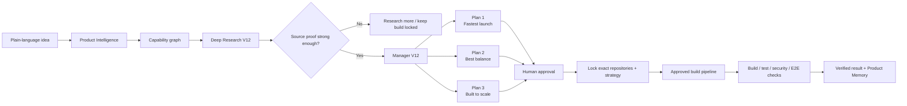
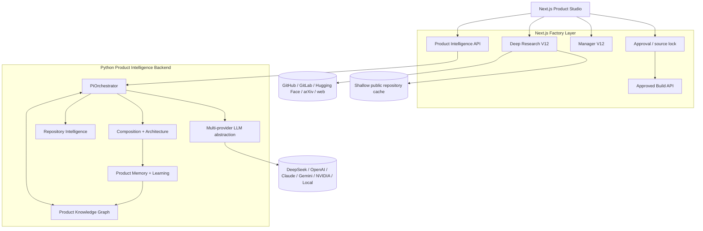

<p align="center">
  
</p>

<h1 align="center">AI Product Factory</h1>

<p align="center">
  <strong>Tell us the outcome. AI works out the product.</strong>
</p>

<p align="center">
  Plain-language product brief → capability map → live source research → deep repository proof → three practical plans → human approval → source-locked build → executable verification
</p>

<p align="center">
  <a href="https://github.com/logeshv586-code/AIproductfactory/actions/workflows/ci.yml"></a>
  
  
  
  
  
  
  
</p>

<p align="center">
  <a href="#-product-studio">Studio</a> ·
  <a href="#-how-it-works">How it works</a> ·
  <a href="#-tested-example-desktop--office-ai-automation">Tested example</a> ·
  <a href="#-tokenless-public-github-research">Tokenless GitHub</a> ·
  <a href="#-verification-contract">Verification</a> ·
  <a href="#-quick-start">Quick start</a>
</p>

---

## ✨ What this product is

AI Product Factory is an evidence-first product engineering system for people who know **what outcome they want**, but do not want to manually research architectures, repositories, licenses, integration boundaries and implementation trade-offs before building.

It does more than generate code from a prompt. The Factory first decides **what should be built**, discovers **what already exists**, proves whether reusable sources actually support the requested capabilities, rejects weak matches, explains several build routes, waits for approval, and only then moves into the build and verification stages.

### Core promise

| Stage | What the user sees | What happens underneath |
|---|---|---|
| **Describe** | Explain the outcome in normal language | Intent, users, platform and constraints are structured |
| **Understand & research** | AI explains what it understood | Capability graph + current source research |
| **Choose** | Compare three practical product plans | Repository inspection, architecture composition and scoring |
| **Build & verify** | Approve one direction and start | Exact source set is locked and executable gates run |

> **90%+ is a recommendation-quality target for supported categories, not a universal correctness guarantee.** The Factory is designed to lock the build gate when the evidence is not strong enough instead of manufacturing confidence.

---

## 🎛️ Product Studio

<p align="center">
  
</p>

The current `/studio` experience is designed for both normal users and technical reviewers:

- **Simple mode** keeps repository internals and developer details out of the way.
- **Expert mode** exposes research telemetry, repository proof, architecture hints, source links and the implementation handoff.
- Users can start from a new idea or improve an existing product.
- Audience, platform, launch priority, privacy and cost preferences shape the recommendation.
- A plan cannot be approved when research quality is below the evidence gate.
- Choosing another plan clears the previous approval so the system cannot silently build an old direction.

---

## 🏭 How it works



### What gets produced

For a supported product brief the Factory can produce:

- structured goal, audience and success outcome;
- capability graph and specialized capability list;
- current public repository discovery;
- README and representative source-file proof;
- repository health, activity, license and runnable-code signals;
- source links pinned to the inspected commit;
- rejected-signal counts instead of silently hiding weak research;
- three customer-friendly architecture/composition plans;
- capability coverage, fit and confidence for each plan;
- product-owned capability gaps where no safe external source should be forced in;
- approval-gated developer handoff;
- source-locked build request;
- executable verification evidence.

---

## 🧪 Tested example: desktop + Office AI automation

The screenshot and current CI flow were exercised with a real product-style brief in this category:

> **Create an application that can automate PowerPoint, Excel, Word documents and desktop applications using vision, understand the screen, perform tasks autonomously and improve over time — delivered as one coherent application.**

### What the Factory needs to understand

That brief is not treated as one broad keyword search. It is decomposed into capability areas such as:

```text
Desktop computer control
Vision / screen understanding
PowerPoint automation
Excel automation
Word document automation
Browser / GUI automation when required
Autonomous task planning
Tool and skill execution
Workflow orchestration
Memory / learning loop when explicitly required
Human approval and audit boundaries
```

### What was verified in CI

The full HTTP flow on **2026-08-21** passed Product Studio hydration, local-provider setup, Product Intelligence, Deep Research V12, Manager V12, approval, selected-plan preservation, source locking and the build pipeline.

Reference run: [AI Product Factory CI #82](https://github.com/logeshv586-code/AIproductfactory/actions/runs/32476845470)

| Check | Observed test result |
|---|---:|
| Live research signals retained | **20** |
| Weak / irrelevant signals rejected | **58** |
| GitHub candidates after strict filtering | **3** |
| Selected customer plan | **Best balance** |
| Approved build source in the general E2E fixture | `screenpipe/screenpipe` |
| Office/desktop qualified repositories in the regression fixture | **3** |
| Research gate | **Passed** |
| Approved build pipeline | **Passed** |

The deterministic regression fixture reached a **100% recommendation-quality score for that fixture**. That number is test evidence for the fixture, **not a promise that arbitrary user ideas will always score 100% or be correct**.

### False-positive protection

The Office/desktop regression specifically exists to prevent bad matches such as:

- a dataset merely containing the word `excel`;
- a PDF extractor being presented as PowerPoint editing automation;
- a generic backend framework being recommended for desktop control;
- an `awesome-*` resource list being treated as runnable product code;
- a repository being selected only because it has many stars.

A repository must prove specialized requested capability in inspected README/source evidence and also pass runnable-code and research-quality guards.

---

## 🔓 Tokenless public GitHub research

**A personal `GITHUB_TOKEN` is no longer required to deeply inspect public GitHub repositories.**

### Without a GitHub token

```text
Capability-specific public GitHub discovery
        ↓
Shortlist candidates
        ↓
Shallow local clone
  --filter=blob:none --no-checkout
        ↓
Map tree at the observed commit
        ↓
Read README with git show
        ↓
Inspect high-signal source files with git show
        ↓
Verify requested capabilities
        ↓
Reject catalogs / data-only / generic / weak matches
        ↓
Pin evidence links to the exact inspected commit
        ↓
Manager V12 recommendation gate
```

The research engine **does not execute cloned repository code** during source research. The clone is used as a read-only evidence surface.

Public shallow-clone snapshots are cached for a limited period to reduce repeated downloads. If public GitHub discovery is rate-limited, the product reports that condition and keeps the evidence gate conservative rather than pretending the search was complete.

### With a GitHub token

A token remains useful as an **optional accelerator** for broader/faster API discovery and inspection. Private repositories still require appropriate authorization.

### Dedicated tokenless CI proof

The dedicated tokenless smoke test forces public-local mode even inside GitHub Actions, where a workflow token normally exists.

Observed test result:

| Tokenless research telemetry | Result |
|---|---:|
| Mode | `public-local-clone` |
| Public repositories discovered | **50** |
| Repositories locally inspected | **6** |
| Repositories source-qualified | **3** |
| Public API rate limited | **No** |

Qualified repositories in that desktop-control fixture:

- [`bytedance/UI-TARS-desktop`](https://github.com/bytedance/UI-TARS-desktop)
- [`microsoft/UFO`](https://github.com/microsoft/UFO)
- [`OpenAdaptAI/OpenAdapt`](https://github.com/OpenAdaptAI/OpenAdapt)

The test also checks that inspected source links are **commit-pinned**, not just moving `main` branch URLs.

---

## 🔬 Deep Research V12

Deep Research V12 treats GitHub repositories as engineering evidence, not search results.

A candidate can be examined for:

- description, topics, language and default branch;
- maintenance recency;
- stars/forks as secondary health signals;
- license metadata and manual-license warnings;
- README depth;
- repository tree size and architecture hints;
- high-signal manifests and source paths;
- representative source content;
- specialized capability proof;
- runnable-code evidence;
- source links pinned to the inspected revision.

### Anti-keyword gate

A repository cannot qualify merely because a requested word appears in its name, dataset, README or stars ranking.

```text
Direct capability proof
        +
README / source inspection
        +
Runnable-code evidence
        +
Relevance / health threshold
        =
Eligible recommendation candidate
```

### Current research surfaces

| Source | Role |
|---|---|
| **GitHub** | Core public repository discovery, local/API source proof, releases |
| **GitLab** | Additional public project leads |
| **Hugging Face** | Open models and runnable AI assets when model capabilities are relevant |
| **Tavily / web** | Optional competitor, product and pricing evidence when configured |
| **arXiv** | Strictly filtered technical-method evidence for relevant AI/research categories |

Unrelated research papers and generic sources are discarded before the recommendation layer.

---

## 🧠 Manager V12

Manager V12 converts source-qualified research into customer-facing product directions.

Repository ranking considers multiple signals rather than stars alone, including:

- direct product relevance;
- specialized capability coverage;
- inspection/evidence strength;
- maintenance health;
- license confidence;
- integration simplicity/complexity;
- architecture complementarity.

The first plan follows the user's priority:

| User priority | First recommendation style |
|---|---|
| **Launch quickly** | Fastest safe route with fewer moving parts |
| **Best balance** | Strong coverage without unnecessary complexity |
| **Built to scale** | More governance, resilience and long-term architecture |

If the user manually chooses another plan, that exact plan remains selected through approval and developer handoff generation.

---

## 🤖 Multi-model provider layer

The product can use multiple reasoning providers through one runtime layer.

| Provider | Runtime support | Notes |
|---|---:|---|
| **DeepSeek** | ✅ | Studio provider option |
| **OpenAI** | ✅ | Chat/reasoning + native embeddings where configured |
| **Anthropic Claude** | ✅ | Chat/reasoning |
| **Google Gemini** | ✅ | Chat/reasoning + embeddings where configured |
| **NVIDIA NIM** | ✅ | OpenAI-compatible NVIDIA endpoint |
| **Local** | ✅ | No paid API key required; used for development/CI fallback |

Model selection is configurable. Repository qualification remains source-driven and cannot be overridden just because a model sounds confident.

---

## 🧩 Understand Anything integration

The repository also contains a project-local integration for [`Egonex-AI/Understand-Anything`](https://github.com/Egonex-AI/Understand-Anything).

```bash
npm run understand:install
npm run understand:status
npm run understand:update
```

This integration improves **codebase/knowledge-base understanding for engineering agents**. It is intentionally separate from the customer-intent layer: Product Factory itself interprets what a normal user means, while Understand Anything can help engineering agents understand the resulting codebase more deeply.

See [`docs/UNDERSTAND_ANYTHING_LOCAL.md`](./docs/UNDERSTAND_ANYTHING_LOCAL.md).

---

## 🏗️ System architecture



### Stack

| Layer | Technology |
|---|---|
| Frontend | Next.js 16, React 19, TypeScript 5, Tailwind CSS 4 |
| UI | Lucide, Radix/shadcn-style components |
| API | Next.js App Router server routes |
| Intelligence backend | Python 3.12, FastAPI, Pydantic |
| Data | Prisma + SQLite by default |
| Research | Public APIs + local shallow Git source inspection |
| Validation | Pytest, ESLint, TypeScript, Next production build, HTTP E2E |

---

## 🚀 Quick start

### 1. Clone

```bash
git clone https://github.com/logeshv586-code/AIproductfactory.git
cd AIproductfactory
```

### 2. Configure environment

```bash
cp env.example .env
```

Minimum local setup:

```env
DATABASE_URL=file:./db/custom.db
PYTHON_BACKEND_URL=http://localhost:8001
PYTHON_BACKEND_PORT=8001
LLM_PROVIDER=local

# Optional — public GitHub research works without it.
GITHUB_TOKEN=
```

### 3. Install dependencies

```bash
npm install
python -m pip install -r python-backend/requirements.txt
```

### 4. Start Product Intelligence

```bash
npm run python:start
```

### 5. Start the Studio

```bash
npm run dev
```

Open:

```text
http://localhost:3000/studio
```

---

## 🔌 Main Factory API flow

| Endpoint | Role |
|---|---|
| `POST /api/factory/pi/strategize` | Product Intelligence + strategy generation |
| `POST /api/factory/research/live` | Deep Research V12 and source qualification |
| `POST /api/factory/manager` | Manager V12 composition ranking and product plan |
| `POST /api/factory/pi/approve` | Approve the chosen strategy/direction |
| `POST /api/factory/build/approved` | Build with the selected repository set locked |

The approved build path checks that the source set does not silently drift after user approval.

---

## ✅ Verification contract

AI Product Factory does **not** treat an LLM confidence percentage as proof that a product is correct.

A product should only be called verified after the relevant executable gates pass:

- [ ] source URL and pinned commit/tag confirmed;
- [ ] requested capabilities have evidence;
- [ ] license/attribution reviewed;
- [ ] dependency installation succeeds;
- [ ] production build succeeds;
- [ ] adapter/contract tests pass;
- [ ] unit and integration tests pass;
- [ ] realistic end-to-end workflow succeeds;
- [ ] security/dependency checks meet the release policy;
- [ ] cost and latency are measured against real product limits.

### CI currently validates

```text
Python dependency installation
Python compile checks
Python tests
Understand Anything adapter validation
Critical npm dependency audit
ESLint
TypeScript typecheck
Next.js production build
Full Product Factory HTTP flow
Tokenless public GitHub research smoke
Commit-pinned source-proof contract
Office / desktop false-positive regression
Selected-plan preservation
Approved source-locked build flow
```

> The npm workflow currently blocks **critical** advisories. Passing that CI step is not the same as claiming that every lower-severity dependency advisory has been eliminated or that a production security review is complete.

---

## 📁 Project structure

```text
AIproductfactory/
├── src/
│   ├── app/
│   │   ├── studio/                         # Product Studio route
│   │   └── api/factory/
│   │       ├── research/live/              # Deep Research V12 route + guards
│   │       ├── manager/                    # Manager V12 API
│   │       ├── pi/                         # Product Intelligence / approval
│   │       └── build/approved/             # Source-locked build
│   ├── components/factory/                 # Studio UI/runtime
│   └── lib/factory/
│       ├── deep-research-v12.ts            # Capability-aware source research
│       ├── tokenless-public-research.ts    # Tokenless local clone inspector
│       ├── manager-v12.ts                  # Strict evidence-backed manager
│       └── manager-v10-priority.ts         # Priority / selected-plan preservation
│
├── python-backend/                         # Product Intelligence backend
├── scripts/
│   ├── ci-e2e.mjs                          # Full Factory flow
│   ├── ci-tokenless-research.mjs           # Tokenless GitHub proof
│   └── install-understand-anything.mjs     # Project-local codebase understanding
├── docs/
│   ├── images/
│   │   └── product-studio-v12.svg          # Current Product Studio visual
│   └── UNDERSTAND_ANYTHING_LOCAL.md
├── .github/workflows/ci.yml
└── env.example
```

---

## 🧪 Development commands

```bash
# web development
npm run dev

# Product Intelligence backend
npm run python:start

# lint
npm run lint

# typecheck
npx tsc --noEmit

# production build
npm run build

# Python tests
cd python-backend && pytest -q

# local Understand Anything status
npm run understand:status
```

---

## 🔐 Security and source-safety principles

1. **Research before generation.**
2. **Never select a repository from stars/name alone.**
3. **Inspect README and capability-bearing source before recommendation.**
4. **Do not execute untrusted cloned repository code during research.**
5. **Pin evidence to the inspected commit.**
6. **Keep source/license/build/test/security evidence separate from model confidence.**
7. **Human approval before autonomous build.**
8. **Lock the exact selected sources before execution.**
9. **Reject weak evidence rather than forcing a repository into the product.**
10. **Measure the runnable product before claiming production readiness.**

---

## 📚 Documentation

- **[Understand Anything local integration](./docs/UNDERSTAND_ANYTHING_LOCAL.md)** — project-local engineering-agent codebase understanding.
- **[Model providers](./docs/MODEL_PROVIDERS.md)** — provider configuration and environment contract.
- **[AI Product Factory v8 architecture](./docs/AI_PRODUCT_FACTORY_V8.md)** — architecture foundation and verification concepts from the earlier manager generation.
- **[AI Product Factory v7 architecture](./docs/AI_PRODUCT_FACTORY_V7.md)** — deterministic manager/Studio architecture foundation.

The active implementation has advanced beyond those earlier architecture documents with **Deep Research V12, Manager V12, strict runnable-source guards and tokenless public GitHub source inspection**. This README describes the current product behavior.

---

## ⚠️ Current scope

AI Product Factory can now execute the complete researched-product flow in CI with local model fallback, public source discovery, deep Git repository inspection, plan selection, approval and source-locked build verification.

There are still important boundaries:

- public GitHub discovery is rate-limited when no token is supplied;
- private GitHub repositories require authorization;
- some external market/web sources require their own API keys;
- model access/quota depends on the configured provider;
- a high recommendation score is evidence for a recommendation, not a guarantee of market success;
- commercial pricing remains a planning hypothesis until measured against real runtime costs and customer behavior.

---

<p align="center">
  <strong>Describe the outcome. Research the evidence. Approve the direction. Build only what can be verified.</strong>
</p>

<p align="center">
  <a href="https://github.com/logeshv586-code/AIproductfactory">Repository</a> ·
  <a href="https://github.com/logeshv586-code/AIproductfactory/actions/workflows/ci.yml">CI</a> ·
  <a href="./docs/MODEL_PROVIDERS.md">Model Providers</a> ·
  <a href="./docs/UNDERSTAND_ANYTHING_LOCAL.md">Understand Anything</a>
</p>