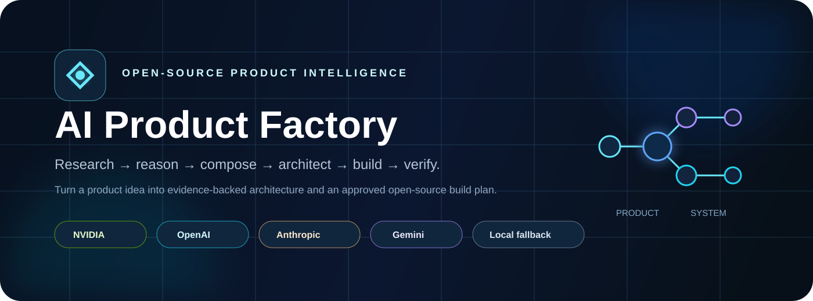
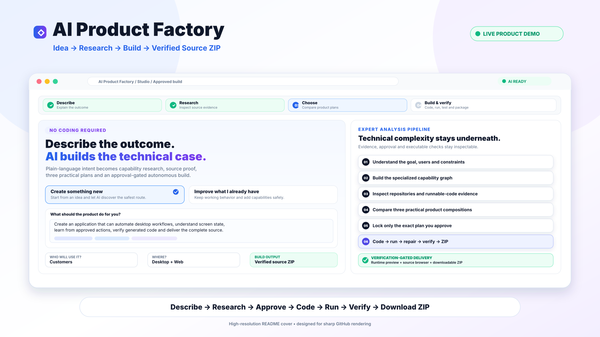
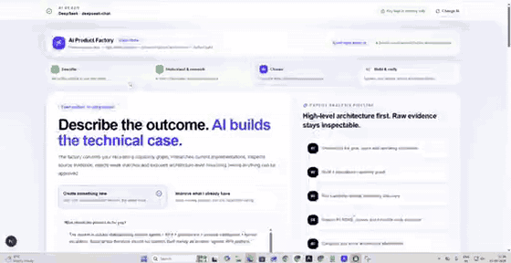
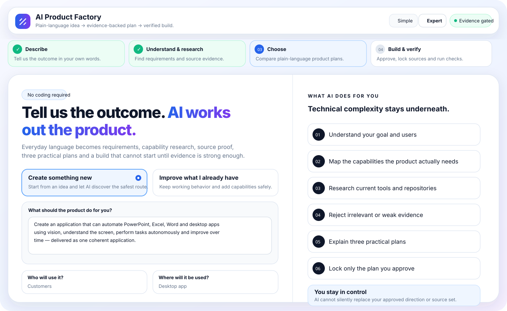
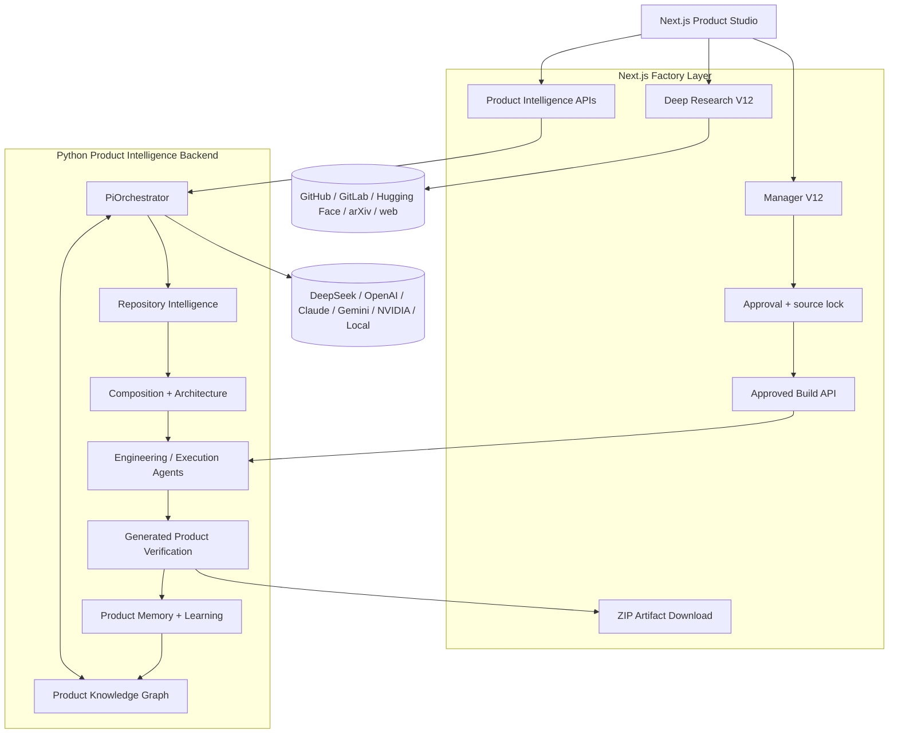

<p align="center">
  
</p>

<h1 align="center">AI Product Factory</h1>

<p align="center">
  <strong>Describe the outcome. Research the evidence. Approve the plan. Let the Factory code, run, verify and package the product.</strong>
</p>

<p align="center">
  Plain-language idea → capability graph → source research → three product plans → human approval → locked engineering agents → running product → executable verification → source ZIP
</p>

<p align="center">
  <a href="https://github.com/logeshv586-code/AIproductfactory/actions/workflows/ci.yml"></a>
  
  
  
  
  
</p>

<p align="center">
  <a href="#-product-demo">Demo</a> ·
  <a href="#-what-the-factory-does">What it does</a> ·
  <a href="#-approved-build-delivery">Build delivery</a> ·
  <a href="#-verification-contract">Verification</a> ·
  <a href="#-quick-start">Quick start</a>
</p>

---

## 🎬 Product demo

<p align="center">
  <a href="./docs/media/ai-product-factory-demo.mp4">
    
  </a>
</p>

<p align="center">
  <strong>4K / 3840×2160 demo cover — optimized for sharp GitHub rendering</strong>
</p>

<p align="center">
  <video controls playsinline preload="metadata" width="100%" poster="./docs/images/ai-product-factory-demo-cover-4k.svg">
    <source src="./docs/media/ai-product-factory-demo.mp4" type="video/mp4" />
  </video>
</p>

<details>
<summary><strong>▶ Animated walkthrough preview</strong></summary>
<br />
<p align="center">
  <a href="./docs/media/ai-product-factory-demo.mp4">
    
  </a>
</p>
</details>

<p align="center">
  <strong><a href="./docs/media/ai-product-factory-demo.mp4">▶ Open the AI Product Factory demo video</a></strong>
  &nbsp;·&nbsp;
  <strong><a href="https://www.canva.com/d/qRNYVuCdMvU3emH">🎨 View the 4K Canva design</a></strong>
</p>

The demo presentation now leads with a 4K high-resolution cover refined at **3840×2160** for crisp text and UI details on GitHub. The animated walkthrough remains available as a secondary preview, and the MP4 stays linked for playback. GitHub clients that suppress embedded HTML5 video will still display the high-resolution cover without the softness of the previous GIF-first layout. See [`docs/DEMO.md`](./docs/DEMO.md).

---

## ✨ What the Factory does

AI Product Factory is an evidence-first product engineering system. It is designed for a user who knows the product outcome they want but does not want to manually research repositories, compare architectures, write integration scaffolding, coordinate coding agents and inspect build evidence before getting usable source code.

The Factory separates **recommendation confidence** from **build proof**:

| Stage | Customer experience | System behavior |
|---|---|---|
| **Describe** | Explain the outcome in normal language | Structures intent, users, platform and constraints |
| **Understand & research** | See what AI understood and why | Builds capability graph and inspects current source evidence |
| **Choose** | Compare three practical product directions | Scores compositions, gaps, health, evidence and trade-offs |
| **Approve** | Pick exactly one direction | Locks the selected strategy and repository set |
| **Code & build** | Start the approved build | Engineering agents create product-owned implementation files |
| **Run & repair** | See verification progress | Syntax, tests, runtime and server checks run; repair passes are attempted |
| **Deliver** | Inspect UI/source and download package | Running product preview + source browser + verification evidence + ZIP |

> A 90%+ recommendation score is a research-quality target for supported categories. It is not a universal correctness guarantee and it does not replace executable verification.

---

## 🎛️ Product Studio

<p align="center">
  
</p>

The `/studio` workflow is customer-first while keeping technical evidence inspectable:

- plain-language idea capture;
- new-product and improve-existing-product modes;
- audience, platform, priority, privacy and cost preferences;
- Deep Research V12 source inspection;
- three understandable product plans;
- source proof and repository due diligence;
- approval-gated plan locking;
- autonomous coding/build stage;
- generated source viewer;
- running product screen;
- executable verification gates;
- **Download full source ZIP** after generation.

---

## 🏭 End-to-end workflow

```mermaid
flowchart LR
    A[Plain-language product idea] --> B[Product Intelligence]
    B --> C[Capability graph]
    C --> D[Deep Research V12]
    D --> E{Evidence gate passed?}
    E -- No --> F[Research more / keep build locked]
    E -- Yes --> G[Manager V12]
    G --> H[Plan A]
    G --> I[Plan B]
    G --> J[Plan C]
    H --> K[Human approval]
    I --> K
    J --> K
    K --> L[Lock exact source set]
    L --> M[Engineering agents]
    M --> N[Generate runnable source]
    N --> O[Tests + static checks]
    O --> P[Start generated app]
    P --> Q[Health + root UI verification]
    Q --> R{All gates pass?}
    R -- No --> S[Repair pass]
    S --> O
    R -- Yes --> T[Running product preview]
    T --> U[Source browser + ZIP download]
```



---

## 🔬 Deep Research V12

Deep Research V12 treats repositories as engineering evidence instead of search results.

A repository may be evaluated for:

- direct requested-capability proof;
- README and representative source files;
- runnable-code evidence;
- language, manifests and architecture hints;
- maintenance and repository health;
- license metadata;
- commit-pinned source links;
- capability-specific relevance rather than stars alone.

Public GitHub research can work without a personal token through public discovery plus shallow local source inspection. A token is an optional accelerator for broader API access; private repositories still require authorization.

The research stage does **not** execute arbitrary cloned third-party source while deciding whether a repository is relevant.

---

## 🧠 Manager V12

Manager V12 converts qualified research into customer-facing product directions. Ranking uses multiple signals, including direct product relevance, specialized capability coverage, source evidence, health, license confidence, architecture complementarity and integration complexity.

The first recommendation follows the chosen priority:

| Priority | Recommendation bias |
|---|---|
| **Launch quickly** | Fewer moving parts and faster safe delivery |
| **Best balance** | Strong capability coverage without unnecessary complexity |
| **Built to scale** | More governance, resilience and long-term architecture |

When a customer selects another plan, the selected composition is preserved through approval and build rather than silently switching back to the default recommendation.

---

## 🔒 Approval and source locking

Approval is a real control boundary.

After approval:

1. the exact customer-selected strategy is preserved;
2. the selected repository set becomes the allowed source set;
3. the approved build API rejects source drift;
4. third-party sources are represented in `SOURCE_MANIFEST.json` and `THIRD_PARTY_NOTICES.md`;
5. product-owned adapters/contracts are generated around approved foundations instead of silently copying complete repositories into the artifact;
6. executable evidence determines whether the build may be called verified.

---

## 🧑‍💻 Approved build delivery

The approved build no longer stops at an architecture document or developer handoff prompt.

The build stage can generate a customer artifact containing:

```text
README.md
BUILD.md
SOURCE_MANIFEST.json
THIRD_PARTY_NOTICES.md
.env.example
requirements.txt
Dockerfile
docker-compose.yml
app/
  main.py
  components/
  adapters/
tests/
  test_app.py
demo/
  index.html
verification.json
build-manifest.json
```

Engineering agents receive implementation tasks from the approved execution plan and may extend the generated repository inside a path-restricted workspace. They are instructed to produce implementation files rather than prose-only handoffs, preserve the locked source set and avoid credentials/secrets.

### Running product preview

The Factory now distinguishes a designed mock from a runtime-verified screen.

For a successful build it:

1. generates the application and root UI;
2. imports the generated FastAPI application;
3. executes the generated test suite;
4. starts the generated app with Uvicorn on an isolated local port;
5. requests `/health`;
6. requests `/` from the running app;
7. captures the HTML actually served by that running process;
8. returns that served UI to the Product Studio.

The Studio labels the preview **Runtime served** only when this path passes.

### Full source ZIP

After verification, the generated workspace is packaged as a ZIP. The Studio exposes a **Download full source ZIP** action through the Product Factory artifact route.

---

## ✅ Verification contract

AI Product Factory does not treat model confidence as build proof.

The current approved-build delivery gate checks:

- approved repository lock;
- product and architecture generation;
- starter blueprint presence;
- minimum full-source output;
- `SOURCE_MANIFEST.json` and `THIRD_PARTY_NOTICES.md`;
- required files and non-empty delivery files;
- Python syntax;
- JSON syntax;
- credential-pattern scan;
- obvious `TODO` / `NotImplemented` placeholder scan for executable source;
- generated root UI source;
- Python import/runtime smoke;
- generated tests;
- live Uvicorn server startup;
- `/health` response;
- `/` runtime product UI response;
- ZIP artifact generation;
- pipeline completion.

If a generated artifact fails a delivery check, the build system can run repair passes before re-verifying it. A result is not labeled verified while required gates remain open.

### Important production boundary

These gates materially strengthen the build result, but production deployment may still require environment-specific validation such as real credentials, external service connectivity, OS-specific desktop automation, dependency/advisory policy, load/performance targets and organization-specific security controls.

---

## 🤖 Model layer

The runtime can use multiple providers through the Product Factory model layer:

| Provider | Support |
|---|---:|
| DeepSeek | ✅ |
| OpenAI | ✅ |
| Anthropic Claude | ✅ |
| Google Gemini | ✅ |
| NVIDIA NIM | ✅ |
| Local deterministic mode | ✅ |

Repository qualification remains evidence-driven even when a reasoning model is configured.

---

## 🏗️ Architecture



---

## 🚀 Quick start

```bash
git clone https://github.com/logeshv586-code/AIproductfactory.git
cd AIproductfactory
cp env.example .env
npm install
python -m pip install -r python-backend/requirements.txt
```

Start the Python Product Intelligence backend:

```bash
npm run python:start
```

Start the Studio:

```bash
npm run dev
```

Open:

```text
http://localhost:3000/studio
```

Minimum local environment:

```env
DATABASE_URL=file:./db/custom.db
PYTHON_BACKEND_URL=http://localhost:8001
PYTHON_BACKEND_PORT=8001
LLM_PROVIDER=local
GITHUB_TOKEN=
```

---

## 🔌 Main Factory API flow

| Endpoint | Role |
|---|---|
| `POST /api/factory/pi/strategize` | Product Intelligence + strategy generation |
| `POST /api/factory/research/live` | Deep Research V12 source qualification |
| `POST /api/factory/manager` | Manager V12 product/composition ranking |
| `POST /api/factory/pi/approve` | Customer strategy approval |
| `POST /api/factory/build/approved` | Source-locked autonomous build + verification |
| `GET /api/factory/build/artifact/:workspaceId` | Download generated full-source ZIP |

---

## 🧪 CI

The GitHub workflow validates the web and Python stacks with:

```text
npm dependency audit at critical severity
ESLint
TypeScript typecheck
Next.js production build
Python dependency installation
Python compile checks
Python tests
Hydrated Product Studio flow
Local model-session flow
Deep Research V12 regression
Manager V12 recommendation gate
Approval and selected-plan preservation
Approved source-locked build
Generated source verification
Running generated product server gate
Tokenless public GitHub research regression
```

Passing CI is evidence about the tested commit and fixture. It is not a universal guarantee for every external service, target environment or arbitrary user idea.

---

## 📁 Important paths

```text
src/components/factory/             Product Studio and delivery UI
src/app/api/factory/                Next.js Product Factory APIs
src/app/api/factory/build/approved  Approved build gate
src/app/api/factory/build/artifact  Generated ZIP delivery
src/lib/factory/                    Research and Manager logic
python-backend/intelligence/        Product Intelligence
python-backend/engine/              Composition pipeline
python-backend/execution/           Coding workspace, agents and verifier
scripts/ci-e2e.mjs                  Full Factory HTTP flow
public/demo/                        In-Studio uploaded demo assets
docs/media/                         README demo media
```

---

## 🔐 Source and security principles

1. Research before generation.
2. Never qualify a repository from stars or name alone.
3. Inspect README/source evidence for requested capabilities.
4. Do not execute untrusted cloned source during research.
5. Keep research evidence separate from model confidence.
6. Require human approval before autonomous build.
7. Lock the exact approved source set.
8. Restrict generated file paths to the build workspace.
9. Scan generated source for embedded credential patterns.
10. Run tests and a real application server before calling the preview runtime-served.
11. Package provenance and third-party source information with the generated product.
12. Do not call a build verified while required executable gates are failing.

---

## 📚 Documentation

- [Product demo](./docs/DEMO.md)
- [Model providers](./docs/MODEL_PROVIDERS.md)
- [Local models](./docs/LOCAL_MODELS.md)
- [Understand Anything local integration](./docs/UNDERSTAND_ANYTHING_LOCAL.md)
- [AI Product Factory V8 architecture](./docs/AI_PRODUCT_FACTORY_V8.md)

---

<p align="center">
  <strong>Idea → evidence → approval → code → run → repair → verify → preview → source ZIP.</strong>
</p>
