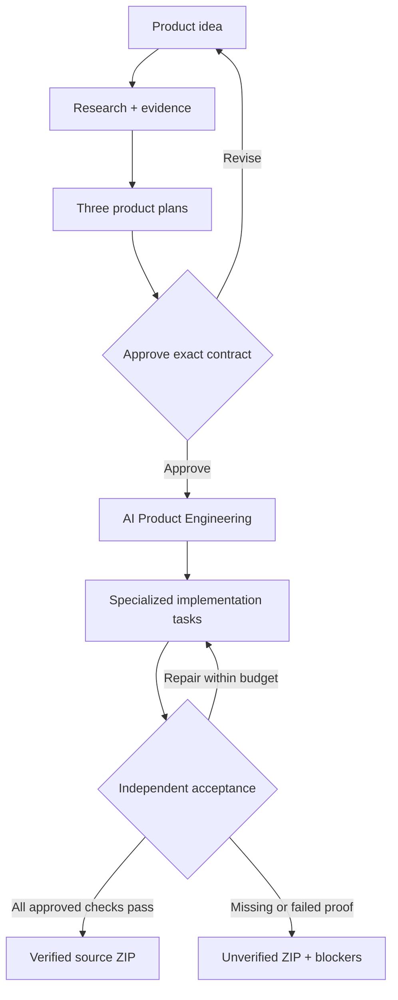

<p align="center">
  
</p>

<h1 align="center">AI Product Factory</h1>

<p align="center">
  <strong>From product idea to researched plan, approved engineering contract, verified implementation and source delivery.</strong>
</p>

<p align="center">
  Idea → Research → Three Plans → Exact Approval → AI Product Engineering → Isolated Verification → Verified Source ZIP
</p>

AI Product Factory is evolving from prompt-based code generation into an **AI Product Engineer**. It does not immediately turn every request into a generic website. It first reasons about the intended outcome, researches useful evidence and implementation patterns, creates three concrete product plans, locks the selected plan as an exact contract, engineers the approved system and independently verifies what actually works.

The **Product Reasoning Core**, established through PR #40, is the canonical product path. It owns requirements, research evidence, experience direction, component interactions, architecture, implementation tasks, acceptance criteria, approval continuity, resumable execution and evidence-bound delivery across model providers.

Models may propose and write code, but the Factory owns the product contract and release rules. A model cannot silently replace the approved plan, redefine acceptance criteria or claim that a runnable scaffold proves the requested business behavior.

[Architecture](./docs/PRODUCT_REASONING_ARCHITECTURE.md) · [Implementation and limits](./docs/PRODUCT_REASONING_IMPLEMENTATION.md) · [Product demo](./docs/DEMO.md) · [CI](https://github.com/logeshv586-code/AIproductfactory/actions/workflows/ci.yml)

## AI Product Engineer workflow

<p align="center">
  
</p>

1. **Understand the product outcome.** Capture the idea, users, platform, privacy, priority, constraints and expected business behavior. A static information experience can stay simple; an interactive problem should become an actual product workflow.
2. **Research before designing.** Inspect relevant public repositories and selected external evidence. Candidate source repositories are tied to a commit revision, inspected README/code evidence and available license information. Missing evidence remains visible instead of being invented.
3. **Create three product plans.** Produce distinct implementation directions: a focused launch, a complete primary workflow and an operationally resilient option. Each plan includes experience direction, requirements, components, architecture, file paths, task dependencies and observable acceptance checks.
4. **Approve exactly one contract.** The selected plan is canonicalized and stored with a SHA-256 hash. If the brief changes, the contract changes and approval must happen again.
5. **Engineer the approved product.** Bounded engineering tasks create the approved React, Python/API, automation or desktop source. Every task operates within explicit files, dependencies and repair/model-call budgets.
6. **Resume instead of restarting.** Durable jobs, checkpoints, worker leases, idempotent enqueue, cancellation and resume preserve completed work when execution is interrupted.
7. **Verify independently.** A provisioned Docker runner compiles Python, runs generated tests, typechecks/bundles React and starts the generated application. A separate evaluator applies approved HTTP/browser acceptance criteria and can capture a preview image.
8. **Deliver source and evidence.** The owner receives an integrity-checked ZIP containing source, the exact contract, source manifest, build manifest, verification evidence and explicit blockers. Missing proof keeps the result **unverified**.



## Product Studio

<p align="center">
  
</p>

The Studio is the human control surface for the Product Reasoning Core. The intended experience is not “enter a prompt and hope for code.” It is a reviewable engineering workflow where a user can inspect the proposed product directions, approve one exact plan, follow durable implementation progress and download the resulting source with its verification state.

The current Studio path covers plan review, exact-plan approval, build progress, reload/recovery behavior, ownership checks and source ZIP delivery. Offline test mode exists to validate the workflow itself; it cannot earn functional product verification.

## What makes this different

Most AI builders optimize for generating code quickly. AI Product Factory is designed around **product continuity and engineering proof**.

| Typical generation flow | AI Product Factory direction |
|---|---|
| Prompt → code | Idea → research → plans → approval → engineering → verification |
| One opaque solution | Three explicit product contracts to compare |
| Generic templates | Product-specific React/Python components and workflows |
| Model decides while building | Approved contract remains the product authority |
| Restart after failure | Durable jobs, checkpoints and resume |
| Generated tests can define success | Acceptance checks are protected from implementation agents |
| “It runs” means done | Requested behavior must have observable evidence |
| Raw code download | Contract + source + manifests + verification + integrity-checked ZIP |
| Approval treated as success | Only measured acceptance-passed outcomes inform engineering memory |

### Core engineering principles

- **Reason before generating.** Understand the user problem and choose the appropriate product form before writing source.
- **Human approval is binding.** Engineering must implement the selected contract rather than silently reranking or reinterpreting it.
- **Original experience over repeated templates.** References and templates are ingredients, not the finished product.
- **Evidence over confidence.** Completion claims must map to executable or observable checks.
- **Repair without scope drift.** Agents may fix implementation defects inside the approved contract and budgets, but cannot redefine the product without new approval.
- **Model independence.** Cloud providers, Ollama, LM Studio and future models should operate behind the same product rules.
- **Safe source use.** Open-source repositories remain pinned reasoning inputs unless their code and licenses are intentionally incorporated.
- **Honest verification.** Native installers, external services, credentials, real-model quality and environment-specific behavior remain unverified until actually exercised.

## AI Product Engineer architecture direction

The Product Reasoning Core provides the shared authority for a progressively stronger virtual product-engineering team:

| Engineering role | Responsibility |
|---|---|
| Product strategist | Clarifies the real problem, users, value and appropriate product form |
| Research agent | Finds evidence, implementation patterns and source candidates with revision/license context |
| UX / experience engineer | Creates original flows, interactions and component behavior for the selected domain |
| Solution architect | Converts the contract into frontend, Python/API, automation, data and integration boundaries |
| Frontend engineer | Builds purpose-specific React/TypeScript interfaces and interactions |
| Backend engineer | Builds Python/FastAPI domain APIs and supporting application behavior |
| Automation engineer | Implements API, event-driven, worker or workflow automation when the contract requires it |
| Verification agent | Runs protected acceptance criteria independently of implementation agents |
| Repair agent | Diagnoses failed checks and repairs implementation defects within explicit budgets |

These responsibilities do not require every product to use every agent. The Factory should compose the smallest engineering team needed for the approved outcome.

## What ships now

| Capability | Current behavior |
|---|---|
| Product reasoning | Research-backed three-plan creation with requirements, experience direction, tasks and acceptance criteria |
| Exact approval | Canonical approved contract bound to a SHA-256 hash; changed briefs require new approval |
| Custom web products | React/TypeScript UI and Python/FastAPI source generated from the approved domain contract |
| Desktop products | Electron layout, renderer and packaging configuration; required Python sidecar/IPC remain engineering tasks and native installation remains unverified |
| Automation products | Python workflow layout plus approved API, retry and recovery behavior; external integrations require their own evidence |
| Model choice | Existing cloud, Ollama and LM Studio onboarding feeds the same Product Reasoning Core |
| Local-only privacy | Loopback local model or offline fixture only; external research and cloud fallback disabled |
| Research evidence | Bounded retrieval with URLs, timestamps, content digests, pinned source excerpts and explicit limitations |
| Ownership | Opaque browser session, server-side token hash, owned plans/jobs/ZIPs and HttpOnly same-site proxy cookie |
| Durable execution | SQLite checkpoints, worker leases, idempotent enqueue, explicit resume and cancel |
| Isolated verification | Docker-based Python/React build and execution plus independent HTTP/browser acceptance evaluation |
| Engineering memory | Owner-scoped, recent acceptance-passed outcomes can inform planning; approval alone is not engineering success |
| Delivery | Source browser, preview evidence when available, check results and integrity-checked downloadable ZIP |

> **Offline test mode is a workflow fixture.** It validates orchestration, approval and delivery behavior. It does not invent a working product and cannot earn functional verification. Real generation requires a capable configured model.

## Powerful next-stage enhancements

The current foundation is intentionally designed so stronger capabilities can be added without weakening approval or verification.

1. **Deeper idea-to-product reasoning** — challenge weak assumptions, identify missing capabilities and distinguish when the right answer is a website, application, automation, desktop experience, service or mixed product.
2. **Research-backed component synthesis** — find relevant OSS patterns, UI interactions and architecture ideas, then create original components adapted to the approved product rather than cloning a repository.
3. **Dynamic engineering teams** — assign only the product, UX, architecture, frontend, backend, automation, integration, verification and repair roles required by the selected contract.
4. **Adaptive architecture** — select React, Python, APIs, event-driven workers, automation, desktop packaging and future services based on the actual product requirements rather than a fixed starter.
5. **Richer acceptance** — expand protected checks to business journeys, accessibility, performance, security, data contracts and integration behavior where the execution environment can prove them.
6. **Deployment profiles** — add cloud, container, desktop and enterprise deployment adapters as separately verifiable delivery stages rather than treating generated configuration as successful deployment.
7. **Enterprise identity and governance** — move beyond trusted browser ownership to authenticated users, teams, quotas, policy controls, audit history and distributed scheduling.
8. **Measured model quality** — evaluate real providers against the same approved contracts and acceptance suites so model choice can be based on engineering outcomes instead of subjective preference.

## Quick start

Requires **Node.js 22**, **Python 3.12** and **npm**. Docker is required to execute and independently verify generated code. Without the isolated runner, the Factory can still produce source but must keep the package explicitly unverified.

```bash
npm ci
python3 -m venv .venv
.venv/bin/pip install -r python-backend/requirements.txt
```

Build the isolated runner from the repository root:

```bash
docker build -f python-backend/execution/runner.Dockerfile -t ai-product-factory-runner:1 .
```

Start both the Python backend and Next.js Studio from the repository root using the cross-platform startup helper:

```bash
# Cross-platform npm helper (auto-detects OS)
npm run dev:all

# Linux / macOS:
./scripts/dev.sh

# Windows (PowerShell):
.\scripts\dev.ps1
```

Alternatively, start the backend and frontend in separate terminals:

```bash
# Terminal 1: Python backend
cd python-backend
../.venv/bin/python runtime_entry.py

# Terminal 2: Next.js Studio
npm run dev
```

Open **http://localhost:3000/studio**, choose a provider, test the connection and enter the product brief. Cloud keys use the existing runtime session mechanism; generated projects do not receive those keys.

| Setting | Purpose / default |
|---|---|
| `PYTHON_BACKEND_URL` | Next.js backend connection; `http://127.0.0.1:8001` |
| `PYTHON_BACKEND_PORT` | Python service port; `8001` |
| `FACTORY_STATE_DIR` | Durable SQLite state; backend-relative `output/factory_state` |
| `FACTORY_OUTPUT_DIR` | Product workspaces and ZIPs; backend-relative `output` |
| `FACTORY_RUNNER_IMAGE` | Prebuilt verifier image; `ai-product-factory-runner:1` |
| `GITHUB_TOKEN` | Optional public research rate-limit improvement |

Persist both state and output directories across restarts. The current ownership model is browser-session ownership for a trusted deployment, not enterprise authentication. Production multi-user hosting needs authenticated accounts, quotas and deployment-level access controls. Keep the Python service private behind the application proxy.

## Generated project structure

```text
app/main.py                 Python domain API and React asset serving
web/src/App.tsx             Product-specific React interactions
web/src/styles.css          Approved visual direction
web/package-lock.json       Runner-compatible dependency lock
workers/workflow.py         Automation profile, when selected
desktop/                    Electron profile, when selected
tests/                      Generated implementation tests
PRODUCT_CONTRACT.json       Exact approved product definition
SOURCE_MANIFEST.json        Locked repository references
THIRD_PARTY_NOTICES.md      Selected-source notices
verification.json           Observed checks and blockers
build-manifest.json         Contract/code binding and task results
README.md                   Generated product setup instructions
.env.example                Configuration placeholders
```

The isolated runner supports an intentionally provisioned dependency set. Additional packages require a compatible runner image; generated code cannot silently install arbitrary dependencies on the Factory host. Reference repositories are reasoning inputs, not automatically vendored source.

## Verification and contribution

```bash
npm run lint
npx tsc --noEmit
npm run build
cd python-backend
../.venv/bin/python -m pytest -q
```

The real-container acceptance test skips locally if Docker or the runner image is unavailable. To require it:

```bash
FACTORY_REQUIRE_RUNNER=1 ../.venv/bin/python -m pytest -q tests/test_factory_core.py -k real_container
```

The CI definition is configured for pull requests, pushes to `main` and manual dispatch. Its intended gates include frontend lint/typecheck/build, contract/ownership/recovery regressions, mandatory real Docker acceptance and a hydrated Studio flow covering exact-plan approval and protected ZIP ownership.

A **verified** result means the exact approved checks passed against the recorded generated source in the available runner. It does **not** imply production deployment, native OS coverage, external-service correctness, credentialed integration success or universal correctness.

See [Product Reasoning Architecture](./docs/PRODUCT_REASONING_ARCHITECTURE.md) and [Implementation and Limits](./docs/PRODUCT_REASONING_IMPLEMENTATION.md) for the detailed design and current boundaries.
