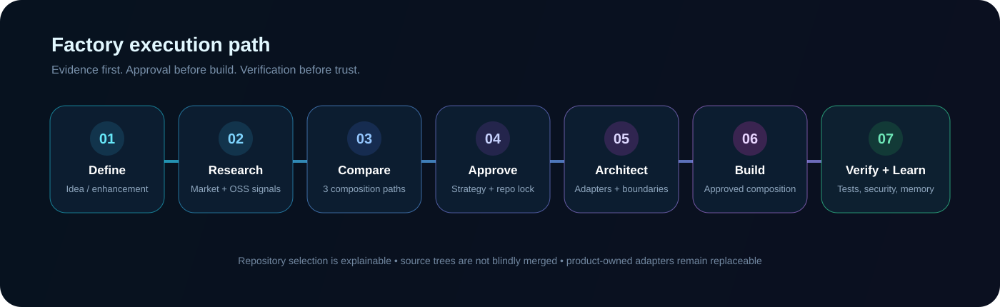
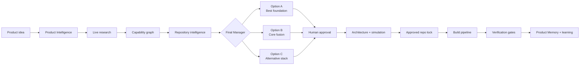
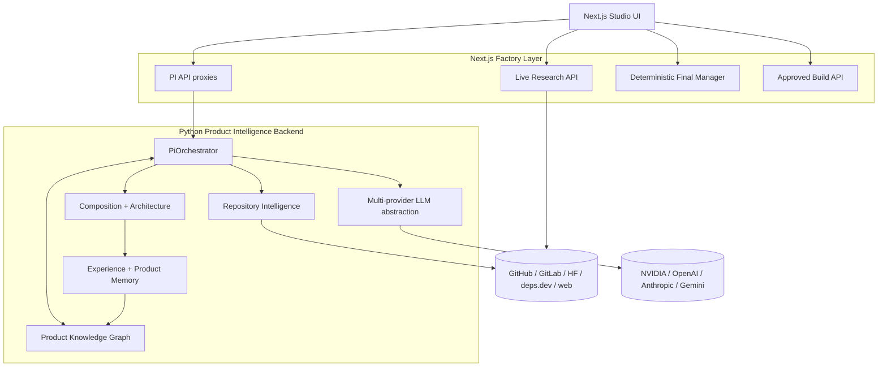

<p align="center">
  
</p>

<h1 align="center">AI Product Factory</h1>

<p align="center">
  <strong>An evidence-first, multi-agent system for turning product ideas into explainable open-source architectures and approved build plans.</strong>
</p>

<p align="center">
  Research current solutions · map capabilities · evaluate repositories · compare composition strategies · model commercial viability · approve · build · verify · learn
</p>

<p align="center">
  <a href="https://github.com/logeshv586-code/AIproductfactory/actions/workflows/ci.yml"></a>
  
  
  
  
  
  
</p>

<p align="center">
  <a href="#-what-ai-product-factory-does">What it does</a> ·
  <a href="#-factory-flow">Factory flow</a> ·
  <a href="#-multi-model-provider-layer">Models</a> ·
  <a href="#-live-research-intelligence">Research</a> ·
  <a href="#-quick-start">Quick start</a> ·
  <a href="#-verification-contract">Verification</a> ·
  <a href="#-documentation">Docs</a>
</p>

---

## ✨ What AI Product Factory does

AI Product Factory is designed for a harder problem than ordinary code generation: **deciding what should be built, discovering what already exists, selecting safe reusable foundations, explaining how those foundations fit together, and only then generating an approved implementation path.**

<table>
<tr>
<td width="25%" valign="top">

### 🔎 Research
Searches current open-source, technical and market signals instead of reasoning from a prompt alone.

</td>
<td width="25%" valign="top">

### 🧠 Reason
Multi-stage Product Intelligence turns the idea into intent, requirements, gaps, capabilities and strategies.

</td>
<td width="25%" valign="top">

### 🧩 Compose
Explains what each selected repository contributes and how to combine it through replaceable boundaries.

</td>
<td width="25%" valign="top">

### ✅ Verify
A recommendation is not treated as proof. Builds must pass explicit source, license, test, security and E2E gates.

</td>
</tr>
</table>

### The result

For one product idea, the Factory can produce:

- a structured product interpretation and requirements graph;
- market, competitor, innovation and gap intelligence;
- capability-by-capability open-source discovery;
- repository due diligence with health, license and integration evidence;
- **three implementation/composition options** with different trade-offs;
- architecture boundaries, data flow and product-owned glue code;
- commercial pricing/margin hypotheses with assumptions;
- an approval-gated autonomous build path;
- an IDE implementation handoff prompt;
- verification evidence and learning signals for future runs.

---

## 🏭 Factory flow

<p align="center">
  
</p>



### The three composition paths

| Option | Purpose | Typical behavior |
|---|---|---|
| **A · Recommended** | Strongest evidence-backed implementation path | Uses the best overall repository portfolio for capability coverage, health, license and integration fit |
| **B · Core fusion** | Combine complementary core capabilities | Usually combines the strongest two/core repositories through adapters or service boundaries |
| **C · Alternative stack** | Reduce architectural lock-in | Tries to use a meaningfully different repository set / stack with minimum overlap |

> **Repositories are not blindly concatenated.** The preferred order is package/dependency → SDK/API adapter → separate service/container → reference-only reimplementation when licensing or integration contracts are unsuitable.

---

## 🧠 Product Intelligence operating system

The Python backend orchestrates specialized reasoning stages over a persistent Product Knowledge Graph.

```text
Product Thinking
    ↓
Intent Intelligence
    ↓
Requirement Intelligence
    ↓
Market + Competitor Intelligence
    ↓
Innovation + Evolution + Gap Analysis
    ↓
Capability Intelligence
    ↓
GitHub / Repository Intelligence
    ↓
Agent Debate + Strategy Tournament
    ↓
Review + Confidence Propagation + Self-Critique
    ↓
Approval Gate
    ↓
Deep Research → Composition → Architecture → Simulation
    ↓
Blueprint → Engineering → Execution → Learning
```

The knowledge graph also stores decision traces, confidence signals, debate evidence, Product DNA and historical learning so future products can reuse successful patterns instead of starting from zero every time.

---

## 🤖 Multi-model provider layer

AI Product Factory supports **NVIDIA, OpenAI, Anthropic Claude, Google Gemini and deterministic local fallback** through one provider abstraction.

| Provider | Chat / reasoning | Embeddings in this integration | Configurable model | Notes |
|---|---:|---:|---:|---|
| **NVIDIA NIM** | ✅ | Local deterministic fallback | ✅ | Uses NVIDIA's OpenAI-compatible endpoint |
| **OpenAI** | ✅ | ✅ Native | ✅ | OpenAI chat + embedding models |
| **Anthropic Claude** | ✅ | Local deterministic fallback | ✅ | Does not require an OpenAI key |
| **Google Gemini** | ✅ | ✅ Native | ✅ | Uses the current `google-genai` SDK |
| **Local** | ✅ deterministic fallback | ✅ deterministic | — | Development, CI and remote-provider failure fallback |

### Recommended provider mode

```env
LLM_PROVIDER=auto
LLM_PROVIDER_ORDER=nvidia,openai,anthropic,gemini

NVIDIA_API_KEY=
OPENAI_API_KEY=
ANTHROPIC_API_KEY=
GEMINI_API_KEY=
```

`auto` tries only configured remote providers in the requested order and falls back locally if all of them are unavailable.

You can also force one provider:

```env
LLM_PROVIDER=nvidia
# or: openai | anthropic | claude | gemini | local
```

Model names are environment-controlled rather than hard-coded:

```env
NVIDIA_MODEL=openai/gpt-oss-20b
OPENAI_MODEL=gpt-5-mini
OPENAI_EMBEDDING_MODEL=text-embedding-3-small
ANTHROPIC_MODEL=claude-sonnet-4-20250514
GEMINI_MODEL=gemini-3.6-flash
GEMINI_EMBEDDING_MODEL=gemini-embedding-001
```

Use a model that is actually available to your provider account. See [Model Provider Documentation](./docs/MODEL_PROVIDERS.md) for the full configuration contract.

---

## 🌐 Live research intelligence

The Final Manager is designed to reason over current evidence, not GitHub stars alone.

| Source | What the Factory uses it for | Mode |
|---|---|---|
| **GitHub** | repositories, releases, issues, maintenance | Core |
| **GitLab** | public open-source alternatives | Live |
| **Hugging Face** | models, datasets and Spaces | Live |
| **deps.dev / OpenSSF** | project health, license, package mapping, Scorecard evidence | Core |
| **OSV** | vulnerability evidence | On demand |
| **Hacker News** | current developer launches / interest | Live |
| **Stack Overflow** | implementation pain points and demand signals | Live |
| **arXiv** | recent technical methods and research | Live |
| **Docker Hub** | container availability | On demand |
| **PyPI / npm** | package / release metadata | On demand |
| **Tavily / web** | competitors, pricing, news and product pages | Configured |

The current Studio live-research route actively collects GitLab, Hugging Face, Hacker News, Stack Overflow, arXiv, GitHub release and optional Tavily signals. Additional catalog sources are used by the wider research and verification design on demand.

---

## 🧬 Repository intelligence

Each candidate repository is treated as an engineering dependency that must be explained—not as a popularity score.

The repository report can include:

- repository purpose and language;
- license evidence;
- health / maintenance signals;
- capability mappings;
- strengths and weaknesses;
- deps.dev / OpenSSF evidence when available;
- selected integration mode;
- exact role inside the resulting product;
- validation steps before adoption.

### Integration modes

```text
dependency-adapter
service-adapter
reference-reimplementation
```

Product-owned code remains responsible for normalized contracts, orchestration, auth/tenant boundaries, UI/API, persistence, observability, cost controls, tests and deployment.

---

## 💰 Commercial intelligence

The Factory can generate a commercial hypothesis alongside the technical architecture:

- Starter / Pro / Business pricing suggestions;
- monthly and annual scenarios;
- modeled per-customer COGS;
- modeled gross margin;
- break-even customer count;
- 100- and 500-customer contribution scenarios;
- implementation / white-label pricing ranges;
- profitability actions such as usage limits, annual prepay, enterprise add-ons and cheaper model routing.

> Pricing is a **model**, not a guaranteed business outcome. Replace modeled infrastructure/API/support costs with real telemetry from the runnable product before making financial commitments.

---

## 🏗️ System architecture



### Stack

| Layer | Technology |
|---|---|
| Frontend | Next.js 16, React 19, TypeScript 5, Tailwind CSS 4 |
| UI / state | Radix UI, shadcn-style components, Zustand, TanStack Query |
| API layer | Next.js App Router + server routes |
| Intelligence backend | Python 3.12, FastAPI, Pydantic |
| LLM adapters | OpenAI SDK, Anthropic SDK, Google GenAI SDK, NVIDIA OpenAI-compatible API |
| Data | Prisma + local SQLite configuration by default |
| Validation | Pytest, ESLint, TypeScript, Next production build, HTTP E2E |

---

## 🚀 Quick start

### 1. Clone

```bash
git clone https://github.com/logeshv586-code/AIproductfactory.git
cd AIproductfactory
```

### 2. Configure environment

```bash
cp env.example .env
```

Minimum local configuration:

```env
DATABASE_URL=file:./db/custom.db
PYTHON_BACKEND_URL=http://localhost:8001
PYTHON_BACKEND_PORT=8001
LLM_PROVIDER=local
```

For remote models, switch to `LLM_PROVIDER=auto` and add any provider keys you want to use.

### 3. Install web dependencies

```bash
npm install
```

### 4. Install Python backend

```bash
cd python-backend
python -m pip install -r requirements.txt
cd ..
```

### 5. Start the Product Intelligence backend

```bash
npm run python:start
```

Python backend: `http://localhost:8001`

### 6. Start the Studio

In another terminal:

```bash
npm run dev
```

Open:

```text
http://localhost:3000/studio
```

---

## 🎛️ Studio workflow

The current `/studio` experience is intentionally approval-gated:

1. Enter a **new product** or **enhancement** brief.
2. Run Product Intelligence strategy generation.
3. Collect current multi-source research evidence.
4. Let the Final Manager explain repository candidates.
5. Compare three composition options.
6. Review commercial assumptions and verification gates.
7. Select a strategy + repository composition.
8. Approve architecture generation.
9. Run the approved repository-locked build pipeline.
10. Copy the implementation handoff into an IDE agent when deeper code generation is required.

---

## 🔌 Main Factory API flow

| Endpoint | Role |
|---|---|
| `POST /api/factory/pi/strategize` | Product Intelligence reasoning + strategy generation |
| `POST /api/factory/research/live` | Current multi-source research |
| `POST /api/factory/manager` | Repository explanation, composition ranking and commercial plan |
| `POST /api/factory/pi/approve` | Continue the approved strategy into architecture / engineering stages |
| `POST /api/factory/build/approved` | Run the build pipeline with the selected repository composition locked |

The approved build path checks that the build does not silently drift to a different repository set.

---

## ✅ Verification contract

AI Product Factory does **not** use an LLM confidence percentage as proof that a product is correct.

A release should only be called verified after executable gates pass:

- [ ] source URL and pinned tag / commit confirmed;
- [ ] license / attribution reviewed;
- [ ] clean dependency installation;
- [ ] production build succeeds;
- [ ] adapter contract tests pass;
- [ ] unit + integration tests pass;
- [ ] dependency / advisory / security checks pass;
- [ ] realistic end-to-end workflow succeeds;
- [ ] cost and latency measured against product limits.

### Continuous integration

The GitHub Actions pipeline validates:

```text
Python dependency installation
Python compile checks
Provider adapter + factory tests
Critical web dependency audit
ESLint
TypeScript
Next.js production build
Full Product Factory HTTP E2E
```

The provider matrix tests NVIDIA, OpenAI, Anthropic and Gemini adapters with mocked SDK clients so CI can validate request/response compatibility without storing real paid API credentials.

---

## 📁 Project structure

```text
AIproductfactory/
├── src/
│   ├── app/
│   │   ├── studio/                 # Product Factory Studio
│   │   └── api/factory/            # Next.js Factory APIs
│   ├── components/factory/         # Studio / manager UI
│   └── lib/factory/                # Final Manager + Factory utilities
│
├── python-backend/
│   ├── intelligence/               # Product Intelligence engines
│   ├── llm/                        # NVIDIA / OpenAI / Anthropic / Gemini providers
│   ├── engine/                     # Build / pipeline primitives
│   ├── agents/                     # Specialized agents
│   └── tests/                      # Provider + backend tests
│
├── scripts/                        # CI / HTTP E2E tooling
├── docs/                           # Architecture and provider docs
├── db/                             # Local database assets
├── .github/workflows/ci.yml        # Strict CI + full Factory flow
└── env.example                     # Environment contract
```

---

## 🧪 Development commands

```bash
# web development
npm run dev

# Python intelligence backend
npm run python:start

# lint
npm run lint

# production build
npm run build

# Python tests
cd python-backend && pytest -q

# Prisma client / schema
npm run db:generate
npm run db:push
```

---

## 🔐 Security and secrets

- Keep `.env` out of Git.
- Use provider API keys only in environment variables / secret stores.
- Provider status metadata must never expose raw keys.
- CI intentionally runs provider adapters without real commercial credentials.
- Review the license and security posture of every external repository before shipping a commercial derivative.

---

## 📚 Documentation

- **[AI Product Factory v8 architecture](./docs/AI_PRODUCT_FACTORY_V8.md)** — explainable open-source product creation, source matrix, composition rules and verification contract.
- **[Model providers](./docs/MODEL_PROVIDERS.md)** — NVIDIA, OpenAI, Anthropic, Gemini, embeddings, automatic failover and environment configuration.
- **[AI Product Factory v7 architecture](./docs/AI_PRODUCT_FACTORY_V7.md)** — deterministic Final Manager and Studio architecture foundation.

---

## 🎯 Design principles

1. **Research before generation.**
2. **Explain repository selection.**
3. **Prefer replaceable integration boundaries.**
4. **Separate evidence from model confidence.**
5. **Human approval before autonomous build.**
6. **Lock selected repositories before execution.**
7. **Measure before claiming verification.**
8. **Learn from previous products.**

---

## ⚠️ Current scope

AI Product Factory already supports multi-provider LLM reasoning, repository intelligence, current research, composition planning, commercial modeling, architecture generation and an approval-gated repository-locked build flow.

Some catalog integrations are intentionally **on demand** rather than queried on every Studio run, and commercial numbers remain hypotheses until validated against real product telemetry. Live paid-provider calls additionally require valid API keys, quota and model access from the provider account.

---

<p align="center">
  <strong>Build from evidence. Compose intentionally. Verify before trust.</strong>
</p>

<p align="center">
  <a href="https://github.com/logeshv586-code/AIproductfactory">Repository</a> ·
  <a href="./docs/AI_PRODUCT_FACTORY_V8.md">Architecture</a> ·
  <a href="./docs/MODEL_PROVIDERS.md">Model Providers</a>
</p>
