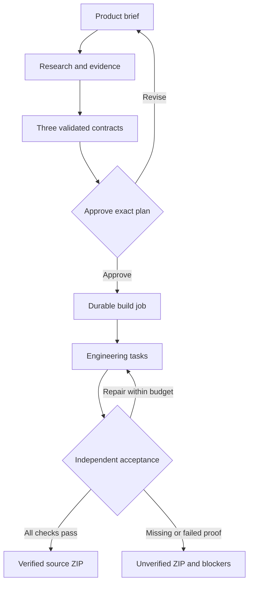

<p align="center"></p>

# AI Product Factory

Describe a product outcome, research the evidence, compare three concrete plans, approve one, and build its source with executable acceptance checks and ZIP delivery.

The **Product Reasoning Core** owns the product decisions and engineering rules across model providers. It turns a brief into requirements, custom components, source choices, a directory structure, implementation tasks and observable acceptance criteria. Models propose and write code; the Factory validates their outputs, preserves the approved scope and records measured results. This is a model-independent orchestration system, not a newly trained neural network or a guarantee of perfect code.

PR #40 established this core as the canonical product path: **idea → research → three plans → exact approval → durable engineering → isolated verification → evidence-bound delivery**. The next evolution is to make that foundation behave like an **AI Product Engineer**: not merely generating a website or scaffold, but reasoning about what product should exist, composing original user experiences, engineering the approved system, recovering from failures and proving what actually works.

[Architecture](./docs/PRODUCT_REASONING_ARCHITECTURE.md) · [Implementation and limits](./docs/PRODUCT_REASONING_IMPLEMENTATION.md) · [Earlier product demo](./docs/DEMO.md) · [CI](https://github.com/logeshv586-code/AIproductfactory/actions/workflows/ci.yml)

## Product workflow

1. **Describe** the idea, audience, platform, priority, privacy and constraints. A simple information website can remain simple; an interactive product should implement its actual domain workflow.
2. **Research** public repositories and selected external sources. Candidate source repositories need a commit revision, inspected README/code samples and license evidence. Unavailable evidence stays visible.
3. **Compare three plans:** a focused launch, a complete primary workflow, and operational resilience. Each model-generated plan includes original experience direction, component interactions, requirements, file paths, task dependencies and acceptance checks.
4. **Approve exactly one contract.** The server stores its canonical SHA-256 hash. Changing the brief creates new plans requiring new approval.
5. **Build asynchronously.** Engineering tasks write only their approved files. The executor schedules every task, persists checkpoints, respects model-call/repair budgets and supports cancellation or recovery after an interrupted worker.
6. **Verify in isolation.** A provisioned Docker runner compiles Python, runs generated tests, typechecks/bundles React and starts the application. A separate evaluator applies the approved HTTP/browser criteria and captures a preview image.
7. **Deliver source and evidence.** Download an owned, integrity-checked ZIP with the contract, source manifest, verification report and build manifest. Missing checks or incomplete tasks keep it explicitly **unverified**.



## AI Product Engineer direction

The Factory is moving from **AI-assisted code generation** toward **goal-driven product engineering**. The Product Reasoning Core remains the authority that keeps every model, agent and generated file aligned with the approved product contract.

| Engineering layer | Direction |
|---|---|
| Product intelligence | Challenge weak assumptions, identify the real user problem and decide whether the result should be a site, application, automation, desktop experience or mixed product |
| Evidence and reuse | Inspect GitHub repositories, documentation and permitted external sources; reuse ideas and patterns with revision and license evidence instead of blindly copying code |
| Experience invention | Generate product-specific React interactions, layouts, workflows and components instead of defaulting to static templates |
| Architecture | Translate the approved plan into explicit frontend, Python/API, worker, automation, storage and integration boundaries |
| Engineering agents | Coordinate specialized planning, UX, frontend, backend, automation, integration, testing and repair responsibilities under one immutable contract |
| Durable execution | Persist jobs, task state, worker leases and checkpoints so long builds can resume rather than restart from zero |
| Verification | Keep implementation agents separate from protected acceptance checks; a runnable scaffold is not considered a completed product |
| Delivery | Produce source, manifests, locked evidence, verification results, blockers and an integrity-checked ZIP that can be audited after generation |
| Learning | Learn only from measured, acceptance-passed outcomes; user approval alone is not treated as proof that the engineering succeeded |

### Core engineering principles

- **Reason before generating.** The Factory should understand the goal and propose a product, not immediately emit a generic site.
- **Human approval is a contract.** Once a plan is approved, engineering cannot silently rerank, reinterpret or replace it.
- **Original experience over template repetition.** Templates and open-source references are ingredients; the generated product should still be purpose-built for the user's workflow.
- **Evidence over confidence.** Every claim of completion should map to observable acceptance results, not model self-assessment.
- **Repair without scope drift.** Agents may fix implementation failures within approved budgets, but cannot change the product contract without new approval.
- **Model independence.** Cloud models, local models and future providers should all operate behind the same reasoning, approval and verification rules.
- **Safe source use.** Reference repositories remain pinned reasoning inputs unless their code and licenses are intentionally incorporated.
- **Honest delivery.** Native installers, external services, credentials, model quality and environment-specific behavior remain unverified until they are actually exercised.

### Powerful next-stage capabilities

The foundation now supports progressively stronger engineering capabilities without changing the approval contract:

1. **Idea-to-product reasoning** — turn a loose request into a differentiated product concept and explain why that form is appropriate.
2. **Research-backed component synthesis** — discover relevant OSS patterns, UI behaviors and architecture ideas, then create original components adapted to the approved product.
3. **Specialized agent teams** — product strategist, researcher, UX engineer, solution architect, frontend engineer, Python/backend engineer, automation engineer, verifier and repair agent working against shared requirements.
4. **Adaptive implementation** — choose React, Python, APIs, automation, event-driven execution, desktop packaging or mixed architecture based on the product rather than a fixed starter template.
5. **Self-recovery** — resume interrupted work, isolate failed tasks, repair within explicit budgets and preserve completed work.
6. **Independent acceptance** — test browser behavior, API behavior and generated source in an isolated runner that implementation agents cannot redefine.
7. **Engineering memory** — reuse successful patterns only when prior acceptance evidence supports them, while keeping project ownership isolated.
8. **Deployment-ready adapters** — add cloud, container, desktop and enterprise integration targets as separately verifiable delivery profiles rather than assuming deployment succeeded.

## What ships now

| Capability | Current behavior |
|---|---|
| Custom web products | React/TypeScript UI and Python/FastAPI source generated from an approved domain contract |
| Desktop products | Electron layout, renderer and packaging configuration; required Python sidecar/IPC are engineering tasks; native installation remains unverified |
| Automation products | Python workflow layout plus approved API, retry and recovery behavior implemented by tasks; external integrations require their own evidence |
| Model choice | Existing cloud, Ollama and LM Studio onboarding feeds the same contract engine |
| Local-only privacy | Only a loopback local model or offline fixture is allowed; external research and cloud fallback are disabled |
| Research | Bounded retrieval with URLs, timestamps, content digests, pinned code excerpts and stated limitations |
| Ownership | Opaque browser session, server-side token hash, owned plans/jobs/ZIPs, HttpOnly same-site proxy cookie |
| Recovery | SQLite checkpoints, worker leases, idempotent enqueue, explicit resume and cancel |
| Learning | Owner-scoped, recent acceptance-passed outcomes inform planning; approval alone does not count as successful engineering |
| Delivery | Source browser, isolated screenshot when available, check results and downloadable ZIP |

**Offline test mode is a workflow fixture.** It does not invent a working product and cannot earn functional verification. Real generation requires a capable configured model. A running health endpoint or passing scaffold test is insufficient evidence of business behavior.

## Quick start

Requires Node.js 22, Python 3.12 and npm. Docker is required to execute and verify generated code. The Factory can still provide an unverified source package when the runner is unavailable.

```bash
npm ci
python3 -m venv .venv
.venv/bin/pip install -r python-backend/requirements.txt
```

Build the isolated runner from the repository root:

```bash
docker build -f python-backend/execution/runner.Dockerfile -t ai-product-factory-runner:1 .
```

Start the backend in one terminal:

```bash
cd python-backend
../.venv/bin/python runtime_entry.py
```

Start the Studio in another:

```bash
npm run dev
```

Open **http://localhost:3000/studio**, choose a provider, test the connection, then enter your brief. Offline test mode exercises the approval and delivery flow without model credentials. Cloud keys use the existing runtime session mechanism; generated projects do not receive those keys.

| Setting | Purpose / default |
|---|---|
| `PYTHON_BACKEND_URL` | Next.js backend connection; `http://127.0.0.1:8001` |
| `PYTHON_BACKEND_PORT` | Python service port; `8001` |
| `FACTORY_STATE_DIR` | Durable SQLite state; backend-relative `output/factory_state` |
| `FACTORY_OUTPUT_DIR` | Product workspaces and ZIPs; backend-relative `output` |
| `FACTORY_RUNNER_IMAGE` | Prebuilt verifier image; `ai-product-factory-runner:1` |
| `GITHUB_TOKEN` | Optional public research rate-limit improvement |

Persist both state and output directories across restarts. The current ownership mechanism is browser-session ownership for a trusted deployment, not enterprise identity. Production multi-user hosting needs authenticated accounts, quotas and deployment-level access controls. Keep the Python service private behind the application proxy.

## Generated project structure

```text
app/main.py                 Python domain API and React asset serving
web/src/App.tsx             Product-specific React interactions
web/src/styles.css          Approved visual direction
web/package-lock.json       Runner-compatible dependency lock
workers/workflow.py         Automation profile, when selected
desktop/                    Electron profile, when selected
tests/                      Generated implementation tests
PRODUCT_CONTRACT.json       Exact approved product definition
SOURCE_MANIFEST.json        Locked repository references
THIRD_PARTY_NOTICES.md      Selected-source notices
verification.json           Observed checks and blockers
build-manifest.json         Contract/code binding and task results
README.md                   Setup instructions
.env.example                Configuration placeholders
```

The runner currently supports a fixed dependency set. Additional packages require an intentionally provisioned compatible runner image; a model cannot silently install arbitrary dependencies on the Factory host. Reference repositories are reasoning inputs, not automatically vendored code.

## Verification and contribution

```bash
npm run lint
npx tsc --noEmit
npm run build
cd python-backend
../.venv/bin/python -m pytest -q
```

The real container acceptance test skips locally if Docker or the image is unavailable. To require it:

```bash
FACTORY_REQUIRE_RUNNER=1 ../.venv/bin/python -m pytest -q tests/test_factory_core.py -k real_container
```

CI runs on pull requests, pushes to `main`, and manual dispatch. It includes contract/ownership/recovery regression tests, frontend checks, a mandatory real Docker acceptance job, and a hydrated Studio flow through exact-plan approval to an explicitly unverified fixture ZIP. The browser flow can also run against local services with `npx playwright install chromium` followed by `node scripts/ci-core-e2e.mjs`.

A verified label means the exact approved checks passed on the recorded code in the available runner. It does not imply production deployment, external service validation, native OS coverage or universal correctness. See the [implementation notes](./docs/PRODUCT_REASONING_IMPLEMENTATION.md) for current limits and migration details.
