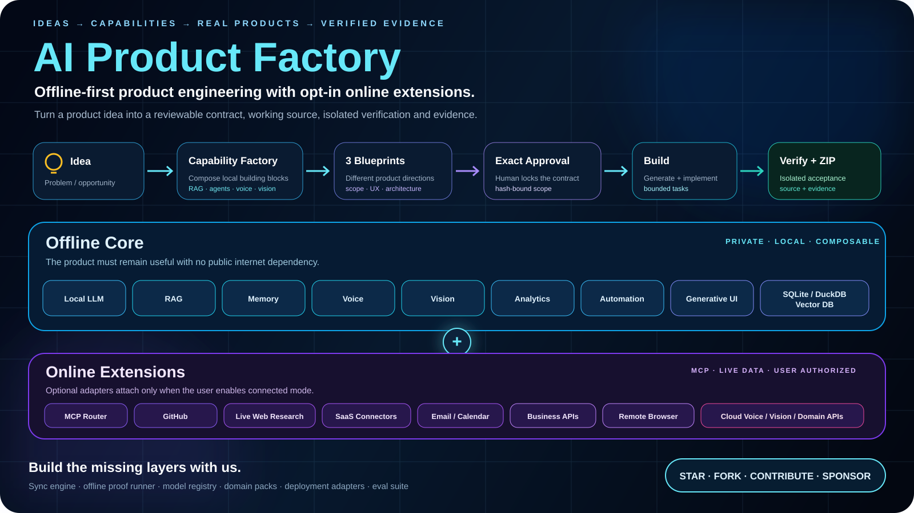
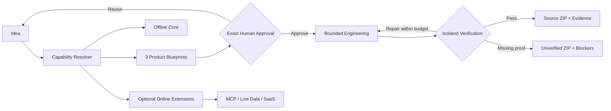

<p align="center">
  
</p>

<h1 align="center">AI Product Factory</h1>

<p align="center">
  <strong>Ideas → capabilities → approved product contracts → working source → isolated verification.</strong>
</p>

<p align="center">
  <a href="https://github.com/logeshv586-code/AIproductfactory/actions/workflows/ci.yml"></a>
  <a href="https://github.com/logeshv586-code/AIproductfactory/stargazers"></a>
  <a href="https://github.com/logeshv586-code/AIproductfactory/forks"></a>
  <a href="https://github.com/sponsors/logeshv586-code"></a>
</p>

<p align="center">
  <a href="#-start-here">Start</a> ·
  <a href="#-the-q--answer-view">Why it is different</a> ·
  <a href="#-capability-factory">Capabilities</a> ·
  <a href="#-product-blueprints">Products</a> ·
  <a href="#-contribute-a-missing-layer">Contribute</a> ·
  <a href="https://github.com/sponsors/logeshv586-code">Sponsor</a>
</p>

---

## ⚡ Start here

**AI Product Factory is not a prompt-to-template generator.** It is an open product-engineering system that reasons about an idea, composes reusable capabilities, creates multiple product directions, locks the chosen direction as an exact contract, builds the approved product, and verifies observable behavior before delivery.

The default architecture is **offline-first**:

- local models through **Ollama** or **LM Studio**
- local RAG, memory, files and databases
- local voice, vision, analytics and automation where possible
- optional **MCP / live web / GitHub / SaaS / business APIs** only when the user explicitly enables connected mode
- local fallbacks so a connected feature does not silently become a core dependency

> **Core rule:** the model can propose and implement. The Factory owns scope, approval, acceptance and release evidence.

---

## ❓ The Q → Answer view

### Q — Why another AI builder?

**A — Because generating code is not the same as engineering a product.**

Most builders optimize for:

`prompt → code`

AI Product Factory is designed around:

`idea → capability composition → product plans → exact approval → engineering → isolated verification → source + evidence`

---

### Q — Does it need the internet?

**A — No. Offline-first is the default.**

A product can use local models, local retrieval, local storage and local tools. When the user enables online extensions, the same product can attach MCP servers, live research, GitHub, email/calendar, SaaS connectors or domain APIs.

```text
OFFLINE CORE
  Local LLM
  Local RAG
  Memory
  SQLite / DuckDB / Vector DB
  Voice / Vision
  Analytics
  Automation
  Generative UI
       │
       └──── optional extension gateway
                    │
                    ├─ MCP
                    ├─ GitHub
                    ├─ Live web
                    ├─ Email / Calendar
                    ├─ SaaS
                    └─ Domain APIs
```

---

### Q — Can a model silently change the requested product while building?

**A — No.**

The selected plan is canonicalized and bound to a contract hash. If the product brief changes, approval must happen again.

---

### Q — Does “the app starts” mean the product is finished?

**A — No.**

The Factory separates generated implementation from protected acceptance. A build is only presented as verified when the available isolated checks prove the approved behavior.

---

### Q — Can people extend the Factory without rewriting it?

**A — That is the design goal.**

Capabilities, product blueprints, model providers, online extensions, verification layers and deployment adapters are meant to evolve independently.

---

## 🧠 Capability Factory

Instead of maintaining hundreds of copied demos, the Factory normalizes reusable patterns into composable capabilities.

| Layer | Examples |
|---|---|
| **Models** | Ollama, LM Studio, hosted providers when enabled |
| **Agents** | single-agent, specialist teams, planner/reviewer loops, trust gates |
| **RAG** | local, hybrid, agentic, graph, multimodal |
| **Memory** | session memory, semantic memory, graph memory |
| **Data** | CSV/Excel analysis, DuckDB, SQLite, local analytics |
| **Developer AI** | codebase intelligence, dependency diagnostics, critique/repair |
| **UI** | generative UI, dashboard canvas, product-specific React flows |
| **Tools** | local MCP, browser/RPA, approved tool routing |
| **Voice** | local ASR → agent/RAG → local TTS |
| **Vision** | local VLM, OCR, OpenCV, video processing |
| **Automation** | scheduled/event-driven agents, local workflow execution |
| **Optimization** | context budgeting, local fine-tuning / LoRA workflows |

See [Offline Capability Factory](./docs/OFFLINE_CAPABILITY_FACTORY.md).

---

## 🧩 Product blueprints

The capability layer can be composed into reusable product families without turning them into fixed templates.

Current blueprint directions include:

| Product family | Typical composition |
|---|---|
| **Private Knowledge Assistant** | local LLM + hybrid RAG + graph citations + memory |
| **Offline Research Workspace** | local corpus + agentic RAG + specialist agents + evidence |
| **Recruitment Copilot** | resume parsing + matching + interview planning + memory |
| **Local Data Analyst** | CSV/Excel/DuckDB + charts + local reasoning |
| **Codebase Copilot** | local git + code intelligence + review + repair + verification |
| **Customer Support AI** | private docs + RAG + memory + generative UI |
| **Voice Support AI** | local ASR + RAG + local LLM + TTS |
| **Document Intelligence** | OCR/VLM + structured extraction + validation + evidence |
| **Dashboard Builder** | data analysis + chat-to-dashboard composition |
| **Local Tool / MCP Agent** | allowlisted tools + approvals + execution evidence |
| **AI Tutor** | course RAG + learner memory + quizzes + adaptive planning |
| **Local RPA Agent** | Playwright/local browser automation + trust gates |
| **Visual Inspection AI** | local vision + evidence frames + dashboard |
| **Content Studio** | local reasoning + voice + media pipeline + review loop |
| **Domain Model Lab** | local datasets + LoRA/fine-tuning + evaluation |

The blueprint is a **starting composition**, not a copied finished application. The approved contract still decides the real product.

---

## 🏗️ Product engineering workflow


```mermaid
flowchart LR
  I["Idea"] --> C["Capability Resolver"]
  C --> P["3 Product Blueprints"]
  P --> A{"Exact Human Approval"}
  A -->|Revise| I
  A -->|Approve| B["Bounded Engineering"]
  B --> V{"Isolated Verification"}
  V -->|Repair within budget| B
  V -->|Pass| Z["Source ZIP + Evidence"]
  V -->|Missing proof| U["Unverified ZIP + Blockers"]

  C --> O["Offline Core"]
  C --> E["Optional Online Extensions"]
  E --> M["MCP / Live Data / SaaS"]
```

### What the Factory protects

- approved requirements
- file/task boundaries
- acceptance criteria
- source provenance
- model/provider provenance
- resumable checkpoints
- ownership of plans/builds/artifacts
- verification evidence
- explicit blockers instead of fabricated success

---

## 🔌 Offline core + online extensions

Connected features are adapters, not hidden foundations.

| Online extension | When enabled | Offline fallback |
|---|---|---|
| Live Web Research | fresh public research | imported/local corpus |
| GitHub MCP | repo/issues/PR workflows | local git + cached metadata |
| SaaS MCP | Notion/CRM/ticketing | local files / SQLite / exports |
| Email / Calendar | scheduling and workflow actions | local draft/manual-action export |
| Live business data | finance/travel/maps/inventory APIs | timestamped local snapshot |
| Remote Browser | approved public web automation | localhost/intranet/browser fixtures |
| Cloud Voice | real-time hosted voice | Whisper/whisper.cpp + local LLM + Piper/Kokoro |
| Cloud Vision | hosted multimodal model | local VLM + OCR + OpenCV/FFmpeg |

This means a product can be **useful offline**, then become **more capable online** when the user chooses.

---

## 🛡️ Verification is a product feature

The Product Reasoning Core does not allow implementation agents to redefine what counts as success.

A generated product can be checked through:

- Python compilation and tests
- TypeScript type checking / React build
- isolated application startup
- protected HTTP acceptance checks
- protected browser acceptance journeys
- source/contract digest binding
- verification manifests
- explicit manual blockers where real credentials, external systems, hardware or target OS behavior cannot be proven

> **Verified means:** the recorded source passed the approved checks available in the verifier.  
> It does **not** mean universal correctness, production deployment, or untested external integration success.

---

## 🚀 Quick start

### Requirements

- Node.js 22+
- Python 3.12+
- npm
- Docker for isolated verification
- Ollama or LM Studio for the offline-first model path

### Install

```bash
git clone https://github.com/logeshv586-code/AIproductfactory.git
cd AIproductfactory

npm ci

python3 -m venv .venv
.venv/bin/pip install -r python-backend/requirements.txt
```

### Start the Studio

```bash
npm run dev:all
```

Or:

```bash
# Linux / macOS
./scripts/dev.sh

# Windows PowerShell
.\scripts\dev.ps1
```

Open:

`http://localhost:3000/studio`

The Studio starts from the offline-first path. Choose an installed local model, describe the product, map its capabilities, review the generated plans, approve one exact contract and build it.

---

## 📴 Fully offline mode

For an air-gapped deployment:

```env
FACTORY_OFFLINE_ONLY=1
LLM_PROVIDER=local
OFFLINE_CORPUS_DIR=./offline-data
OFFLINE_CAPABILITY_LIBRARY=1
```

With `FACTORY_OFFLINE_ONLY=1`:

- public-network Product Intelligence calls are blocked
- hosted model sessions are rejected
- loopback services remain available
- Ollama / LM Studio can still provide real local inference
- external research is not silently attempted

Read [Local Models](./docs/LOCAL_MODELS.md) and [Offline Capability Factory](./docs/OFFLINE_CAPABILITY_FACTORY.md).

---

## 🧪 Development and verification

```bash
npm run lint
npx tsc --noEmit
npm test
npm run build

cd python-backend
../.venv/bin/python -m pytest -q
```

Build the isolated runner:

```bash
docker build -f python-backend/execution/runner.Dockerfile \
  -t ai-product-factory-runner:1 .
```

Require the real container acceptance path:

```bash
FACTORY_REQUIRE_RUNNER=1 \
../.venv/bin/python -m pytest -q tests/test_factory_core.py -k real_container
```

---

## 🌱 Contribute a missing layer

The easiest way to contribute is not “rewrite the Factory.” Pick one missing layer and make it stronger.

### High-value contribution zones

| Missing / evolving layer | What a contribution could add |
|---|---|
| **Offline Proof Runner** | prove generated products run with network disabled |
| **Sync Engine** | connected sync → signed/local snapshots → offline RAG |
| **Model Registry** | discover local models, roles, capabilities, checksums and licenses |
| **Embedding Registry** | local embedding/reranker discovery and benchmarking |
| **Domain Packs** | reusable capability packs for education, operations, developer tools, documents, etc. |
| **Evaluation Suite** | repeatable product/agent/RAG/voice/vision benchmarks |
| **Deployment Adapters** | Docker, VPS, desktop, edge and enterprise profiles |
| **Security Layer** | SBOM, dependency policy, secret scanning, sandbox hardening |
| **MCP Gateway** | user-approved local + remote MCP routing with fallbacks |
| **Voice / Vision Adapters** | standardized offline and optional cloud providers |
| **Generative UI** | richer typed UI artifacts, forms, canvases and workflow surfaces |
| **Observability** | trace model/tool decisions without leaking secrets |
| **Product Memory** | learn only from acceptance-passed outcomes |

Before starting a large change, open a **Capability Request** or discussion-quality issue so the architecture and boundaries can be agreed first.

Read [CONTRIBUTING.md](./CONTRIBUTING.md).

---

## 🤝 Contribution philosophy

Good contributions should strengthen at least one of these:

1. **Capability** — the Factory can solve a new class of problem.
2. **Reliability** — existing capability becomes safer or more deterministic.
3. **Verification** — the Factory can prove more of what it claims.
4. **Offline quality** — a cloud dependency becomes local-first or gains a real fallback.
5. **Extension quality** — an online integration becomes explicit, permissioned and replaceable.
6. **Developer experience** — installation, testing, debugging or contribution gets easier.
7. **Product experience** — generated products become more useful, original and reviewable.

A contribution should not weaken exact approval, hide external dependencies, or redefine acceptance from inside implementation code.

---

## 🧭 Repository map

```text
src/
  app/                         Next.js Studio + API proxies
  components/factory/          Product Factory UI
  lib/factory/                 Studio/backend integration

python-backend/
  factory_core/                contracts, reasoning, research, durable state
  capabilities/                offline capabilities, blueprints, online extensions
  intelligence/                product/repository/market reasoning layers
  llm/                         provider abstractions and routing
  execution/                   approved build + isolated verification
  memory/                      graph/vector memory
  tests/                       contract and regression coverage

skills/                        reusable local skills
mini-services/                 MCP/local service experiments
docs/                          architecture, model and workflow documentation
.github/                       CI, contribution and issue workflow
```

---

## 💡 Project principles

- **Offline first, connected by choice**
- **Compose capabilities, do not clone demos blindly**
- **Human approval before irreversible build scope**
- **Evidence over confidence**
- **Repair without scope drift**
- **Models are replaceable; product rules are not**
- **External integrations are explicit**
- **Open-source references require provenance and license review**
- **A failed check is more useful than a fake green badge**

---

## ❤️ Sponsor the Factory

AI Product Factory is built as an open system for people who want AI to engineer useful products—not just generate impressive-looking scaffolds.

If you want to support development of the offline runtime, verification infrastructure, capability packs and open contributor ecosystem:

<p align="center">
  <a href="https://github.com/sponsors/logeshv586-code">
    
  </a>
</p>

Sponsorship does not change the verification rules or give generated claims special treatment. It helps fund the work required to make the system more capable, testable and accessible.

---

## 📚 Deep dives

- [Product Reasoning Architecture](./docs/PRODUCT_REASONING_ARCHITECTURE.md)
- [Product Reasoning Implementation](./docs/PRODUCT_REASONING_IMPLEMENTATION.md)
- [Offline Capability Factory](./docs/OFFLINE_CAPABILITY_FACTORY.md)
- [Local Models](./docs/LOCAL_MODELS.md)
- [Model Providers](./docs/MODEL_PROVIDERS.md)
- [Demo](./docs/DEMO.md)
- [Full Build Delivery](./docs/FULL_BUILD_DELIVERY.md)

---

## ⭐ Help this project grow

If the direction is useful to you:

**Star** the repo so more builders can discover it.  
**Fork** it and experiment with a capability or product blueprint.  
**Open an issue** for a missing layer.  
**Contribute** a tested implementation.  
**Sponsor** the work if you want to accelerate the open roadmap.

<p align="center">
  <strong>Build useful systems. Keep humans in control. Prove what works.</strong>
</p>
