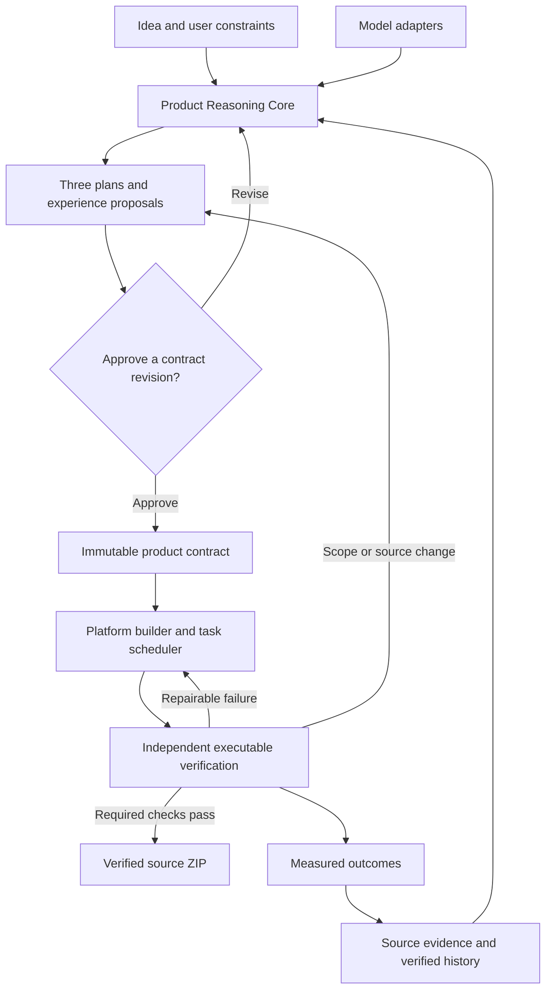

# Product Reasoning Core: architecture proposal

Status: proposed architecture, not a claim of implemented runtime functionality.

Repository reviewed: `logeshv586-code/AIproductfactory`, commit `0a9686b5fdebb08e37be20d2ddfae5ad3c440193`, 16 September 2026. This proposal extends the existing Factory; it does not replace it with another generic agent framework.

## 1. Product promise

A customer describes an outcome. The Factory understands the problem, researches suitable existing foundations, proposes three materially different solutions, explains a recommendation, and builds the approved solution with its own domain-specific components. It delivers source, setup instructions, provenance and executable evidence in a ZIP.

The product must distinguish an attractive preview, a running scaffold, a functionally verified application and a production deployment. A running server is useful evidence, but it does not prove that a requested workflow works.

The proprietary feature is the **Product Reasoning Core**: a versioned decision system that connects requirements, evidence, design choices, implementation tasks and measured outcomes. Models supply proposals and code; the Factory owns state, constraints, source selection, approval, execution policy, acceptance criteria and release decisions.

“Learning” initially means retrieving verified outcomes and improving evaluated decision policies. Calling model APIs, adding memory or repeating a critique does not change the neural-network weights of those models. Fine-tuning a model we control is a separate future workstream requiring a curated dataset, permission to use it, evaluation and rollback.

## 2. What the current code actually establishes

These are findings from source inspection, not results of a new full runtime test.

| Area | Existing implementation | Gap that this design addresses |
|---|---|---|
| Product reasoning | `python-backend/intelligence/pi_orchestrator.py` invokes intent, product thinking, requirements, market, innovation, capability, strategy, critique and memory modules. | Reasoning records need an enforceable connection to the generated product and its acceptance checks. Adding another role name alone will not supply that connection. |
| Approval continuity | `src/app/api/factory/build/approved/route.ts` accepts optional `runId` and `strategyId`. | It sends an idea, caller-provided repositories and `strategy: 'all'` to `/pipeline/run`; it does not load the saved approved strategy before generation. Echoing an ID in the response is not approval binding. |
| Product selection | `python-backend/engine/pipeline.py` generates alternatives, ranks them and builds the first product. | The approved-build path must execute the selected saved plan, without reranking it into a different product. |
| Source boundary | The approved route checks that returned repository names are within the supplied allowed set. | This permits subsets, does not bind commits or dependency versions, and does not establish server-owned approval. Compare a persisted source lock and exact revisions. |
| Runtime output | `python-backend/execution/product_builder.py` produces a FastAPI app, source manifest, tests, HTML, runtime smoke evidence and ZIP. | The baseline `/api/run` returns a generic completed response. Component services echo payloads. This can pass smoke tests without implementing the business feature. |
| Creativity | `_demo_html` supplies a fixed HTML/CSS layout with substituted product text. | Generate domain-specific interactions, visual design and components from an approved experience specification; generic cards are only a scaffold. |
| Work completion | `_flatten_tasks` stops at `MAX_TASKS = 8`. | Required work must remain queued or explicitly blocked, never silently truncated and treated as finished. |
| Agent context | `ExecutionAgent.execute_task` builds a task prompt and writes returned files. | Supply the relevant existing files, locked interfaces, requirement IDs and failures; a prompt asserting “existing repository” does not itself provide its contents. |
| Learning | `PiOrchestrator.approve` records repository approval; `learning_store.py` increases a quality score for approval. | Approval is preference evidence. Record build success, runtime success and adoption separately; approval alone must not count as engineering success. |
| CI | `.github/workflows/ci.yml` defines useful checks with only `workflow_dispatch`. | Add pull-request and main-branch triggers, then require the agreed checks in repository settings. |

The initial implementation priority is therefore approval continuity and truthful feature verification, followed by custom experience generation and platform-specific builders.

## 3. Logical architecture

Keep the Next.js Studio and Python backend. Extend the current knowledge graph to carry the contract and evidence links. Use one canonical run store and one authoritative state machine for the existing entry points. Avoid introducing a second competing “brain” beside the two existing pipeline paths.

For the first release, keep orchestration in the existing Python service with persistent jobs, leases and checkpointed state. PostgreSQL is the proposed shared run store; SQLite remains suitable for a single-process developer mode. Add object storage for large artifacts and evidence. A vector index is optional retrieval infrastructure, not the source of truth.

LangGraph is a candidate orchestration adapter if the team chooses to adopt a framework later. Its documented checkpoint and interrupt mechanisms fit durable state and user review, but a framework migration is not required to fix the current approval path. See [persistence](https://docs.langchain.com/oss/python/langgraph/persistence) and [interrupts](https://docs.langchain.com/oss/python/langgraph/interrupts).

## 4. Reasoning layers and their concrete outputs

| Layer | What it decides | Required output and correction rule |
|---|---|---|
| Intent | Who is the product for, what job must it accomplish, and which constraints are explicit? | Structured brief, user journeys, target platform, assumptions and exclusions. Ask only questions that materially change feasibility or scope. User constraints outrank inferred preferences. |
| Evidence | Which claims and foundations are supported? | Evidence ledger with source URL, retrieval time, revision/hash, excerpt or file location, claim, limitations and provenance. Unsupported claims remain hypotheses. |
| Product opportunity | What useful improvement can this product offer? | Candidate features linked to user needs and observed gaps, with value, cost and uncertainty. Never claim global novelty from a limited search. |
| Experience | What should this particular product look and behave like? | Design tokens, page map, domain-specific component contracts, interactions and loading/empty/error/accessibility states. |
| Architecture | Which stack and boundaries satisfy this platform and workload? | Stack decision, data model, API contracts, file manifest, dependency graph, build commands and platform acceptance profile. |
| Critique | Are there contradictions or unsupported decisions? | Findings linked to exact nodes and a bounded repair plan. Deterministic constraints cannot be overridden by a model's score. |
| Engineering | Which changes implement the approved contract? | Dependency-ordered tasks, owned files, patches and requirement-to-test traceability. Read existing code before editing it. |
| Verification | Does the delivered product perform the approved behavior? | Independent runner evidence against the approved criteria, plus functional, runtime, UX and platform results. Missing results mean unverified. |
| Outcome learning | Which prior decisions actually worked? | Separate preference, build, acceptance and deployment outcomes with environment, model/policy versions and provenance. |

Every layer uses an explicit cycle: propose → validate → record findings → revise affected outputs → validate again. Start with at most two local repair rounds per stage, configurable under the run budget. If uncertainty or failures remain, report the exact blocked requirement. Do not loop indefinitely or lower criteria to get a green result.

## 5. Research that supports decisions

Search in proportion to the problem; “all GitHub repositories” is neither possible nor a useful completion criterion.

1. Build a research checklist from must-have capabilities, platform constraints and uncertain assumptions.
2. Search official documentation and APIs, relevant GitHub/GitLab implementations, package registries, and model cards or papers when the requested feature needs AI. Use market and community signals to identify problems, not as proof that an integration works.
3. Inspect representative source, manifests, interfaces, tests, maintenance signals and license metadata. Record exact commits and dependency versions. Identify whether a source is inspiration, a dependency, a service integration or code to adapt.
4. Compare feasible alternatives, including building a small original component. A product with no necessary external repository must be valid; remove the arbitrary “at least one selected repository” constraint in the new contract path.
5. Record contradictions, inaccessible sources and unresolved evidence. A fallback generated by an LLM is not a retrieved fact.
6. Stop when the required capability decisions have enough evidence and unresolved items are explicitly surfaced, or when time/cost limits are reached. A budget-limited report must say research is incomplete.

Proposed ranking starts with hard exclusions: incompatible platform, conflicting user constraints, unusable license conditions, or insufficient evidence for a critical dependency. Then compare capability fit, source proof, integration effort, operational cost and maintenance. Weights belong to the chosen product priority and are versioned. Stars are a secondary signal. Scores are ranking heuristics until calibrated against outcomes; they are not correctness probabilities.

Source content is untrusted input. Its instructions cannot change the run's policies, retrieve secrets or authorize commands. Keep copied-code notices and modifications traceable. A paper or a repository listing alone is not permission to copy an implementation.

## 6. Genuine customization and three useful plans

The Factory should evaluate whether interactivity helps the user's goal. A static page can be the right answer for a simple informational site. Booking, workflow, inventory, quoting or collaboration goals require working interactions and persistence where appropriate. Avoid forcing either a static template or an unnecessary application.

For “create a timber supplier website,” the Factory could propose:

| Plan | Proposed scope | Trade-off |
|---|---|---|
| Fast launch | Original brand layout, searchable catalogue, specification pages and a working enquiry submission. | Smaller scope; stock and quote preparation remain manual. |
| Recommended workflow | Custom timber quantity calculator, comparison, quote basket, saved enquiries and an administration workflow. | Requires business rules, persistence and more acceptance checks. |
| Operations platform | Inventory integration, customer accounts, quote approval and order tracking. | Depends on available systems, integration access and a larger operating budget. |

These are example proposals, not features to add automatically to every website. Explain the recommendation using the customer's stated goal, evidence and constraints. Show included/excluded scope, estimated effort and costs with assumptions, risks, selected foundations and a clickable experience preview where useful. The user may edit a plan before approval.

A custom component is specified as behavior as well as appearance. For example, `TimberQuantityCalculator` needs units, dimensions, validation, rounding rules, calculated outputs, keyboard behavior and error states. Its approved rounding rules become tests. Do not display fabricated prices, stock or sustainability claims when data is unavailable.

Component generation combines reusable primitives with original domain components, tokens and workflows. Record whether each element is original, adapted or reused. Do not equate changing colors, renaming cards or embedding AI chat with original product design.

## 7. One approved product contract

The canonical contract is stored server-side and includes:

| Field group | Contents |
|---|---|
| Identity | Tenant, project, run, contract ID, revision and schema version. |
| Intent | Original request, outcome, target users, constraints, assumptions and exclusions. |
| Selection | Exact selected plan ID, rationale, included and excluded requirement IDs. |
| Requirements | Stable IDs, priorities, acceptance criteria IDs and dependencies. |
| Experience | Pages, design tokens, component inputs/outputs, interactions and UI states. |
| Architecture | Platform, stack, data entities, interfaces, deployment needs and file manifest. |
| Provenance | Evidence IDs and an exact source/dependency lock with license and adaptation metadata. |
| Execution | Task graph, allowed output paths, task-to-requirement mappings and budgets. |
| Acceptance | Checks, fixtures, expected outcomes, target environments and required/optional status. |

An approval record references the immutable canonical contract hash, contract revision, approving actor and timestamp. Compute the hash from a documented canonical JSON representation. The backend, not a submitted `approved: true` field, creates and checks approval. A hash detects drift; authentication and authorization establish who may approve it.

The build API takes `{ runId, approvalId, contractHash, idempotencyKey }`. It loads the saved contract, checks ownership and approval, validates the hash and source lock, then enqueues that exact build. It must not generate new alternatives. Repeated submissions return the existing build for that idempotency key.

A change in approved scope, platform, source revision or acceptance criteria produces a new contract revision requiring review. An implementation repair inside the approved boundaries can continue automatically. An external service credential that is not available produces a blocked integration check; it must not produce fabricated success.

## 8. Execution states, recovery and failure handling

Persist states: `draft`, `researching`, `planning`, `awaiting_approval`, `approved`, `building`, `verifying`, `repairing`, `ready`, `blocked`, `failed`, `cancelled`.

Legal transitions are checked server-side. Only a persisted approval permits `building`; only passing all required checks permits `ready`. Failed research can return to planning or become blocked. Verification may return to engineering for a bounded repair. Cancellation terminates running work, records partial evidence and prevents a late worker from publishing a ready artifact.

Persist stage inputs/outputs, parent hashes and status transitions. Use optimistic version checks, worker leases and task idempotency keys to avoid duplicate execution and concurrent overwrites. On restart, reclaim expired work and resume from the last valid checkpoint. Invalidate only dependent outputs when an input changes. Store user-facing decision summaries and evidence, rather than relying on hidden model reasoning as persistent state.

Replace long synchronous build requests with job submission and streamed progress or polling. Budget wall time, model tokens, tool calls, source retrieval, compute and repair attempts. Work beyond a per-batch limit remains pending; a batch limit must never delete required tasks.

## 9. Stack and output structure follow the product

React with TypeScript and Python/FastAPI are preferred defaults, subject to the approved need and researched compatibility.

| Target | Proposed profile | Required platform proof |
|---|---|---|
| Interactive web application | React frontend; FastAPI service when backend behavior is needed; storage selected from data/concurrency needs. | Frontend build, API integration, core browser journeys, persistence and responsive/accessibility checks. |
| Content website | React/Next.js rendering approach selected for content, search and hosting requirements; no backend unless required. | Content, navigation, enquiry behavior if included, rendering, accessibility and metadata checks. |
| Desktop application | React with an evaluated Electron or Tauri shell; Python worker/sidecar where useful. | Launch, IPC, offline behavior if promised, packaging and installation checks on each requested OS. |
| Automation | Python workers; supported API integration first where available, browser/desktop automation when required. | Retry behavior, idempotency, duplicate prevention, recovery, audit evidence and target-system checks. |

Tauri can package external sidecar binaries; a Python runtime or packaged executable still needs platform-specific handling. This is an implementation option, not evidence that today's Factory already generates installers. See [Tauri sidecars](https://v2.tauri.app/develop/sidecar/).

Generated project layout should be a manifest, chosen before coding. A web application may use:

| Path | Responsibility |
|---|---|
| `apps/web/src/features/<domain>/` | Domain pages, original components and workflows. |
| `apps/web/src/components/ui/` | Shared accessible primitives and design tokens. |
| `services/api/app/` | API, domain services, persistence and integrations. |
| `workers/` | Long-running jobs, only when required. |
| `contracts/` | Approved API schemas and product contract snapshot. |
| `tests/acceptance/` | Criteria-linked behavioral checks. |
| `tests/integration/` | Interface, persistence and external-system checks. |
| `docs/` | Setup, architecture, operation and known limitations. |
| `provenance/` | Source lock, dependency inventory and third-party notices. |

A desktop profile adds `apps/desktop/` and platform packaging. An automation profile adds workflow definitions, adapters and operational configuration. Do not create empty directories to suggest capabilities that were not implemented.

## 10. Engineering and verification

Create tasks from the approved file manifest and requirements. Each task names its inputs, dependencies, allowed files, interface obligations and acceptance criteria. The scheduler can run independent tasks concurrently once isolated workspaces and merge checks exist; it must serialize conflicting edits. The verifier owns the release decision.

Use isolated, disposable build environments with resource limits, an unprivileged identity and restricted network access. Keep application credentials outside generated repositories and ZIPs. The current subprocess checks are not a security boundary. Treat package installation and generated tests as code execution too.

Separate engineering-generated tests from the acceptance evaluator. Keep approved fixtures, expected outputs and criteria outside the writer's editable workspace. The runner emits signed or otherwise authenticated evidence bound to the code digest, contract hash, runner version and environment. A generated `verification.json` or a model saying “passed” cannot be authoritative.

Required gates should include:

1. **Approval:** exact contract revision and source lock match the persisted approval.
2. **Coverage:** every included must-have requirement has implementation tasks and acceptance criteria; all required tasks finish. Deferred optional scope is explicit.
3. **Build:** dependencies resolve from lockfiles; the relevant Python/TypeScript/native build and static checks pass.
4. **Behavior:** approved inputs produce the expected outputs and side effects. Include invalid inputs and at least the material failure paths.
5. **Integration:** persistence survives a restart where promised; adapters actually exercise the configured contract. Distinguish fixtures from live-service verification.
6. **Experience:** actual primary actions work; loading, empty and error states render; keyboard and responsive behavior meet the approved profile.
7. **Platform:** the actual web/desktop/automation target runs. A Linux smoke test does not certify a Windows installer.
8. **Delivery:** the ZIP extracts into a clean workspace, contains required source/configuration/notices and can reproduce the tested build using documented steps.

Use browser tests against rendered behavior, with stable semantic locators and assertions, instead of checking for a fixed branding string. Playwright documents retrying assertions suitable for asynchronous UI state: [assertions](https://playwright.dev/docs/test-assertions).

Failures must identify their class: misunderstanding → intent revision; insufficient support → research; dependency incompatibility → architecture; implementation failure → engineering; UX failure → experience; environment issue → blocked platform validation. Re-run affected checks and the final required release suite after a repair. Do not weaken an assertion because it fails.

## 11. Model independence and outcome learning

Keep the existing provider interface. Add structured response validation, capability selection, timeouts, bounded retries, cost accounting and model/version provenance. Select a capable model for design or code work according to the project's privacy and budget constraints. Falling back to another provider must preserve those constraints.

The deterministic local provider remains useful for demos and regression fixtures. It should be explicitly labelled fixture mode and must not be presented as an autonomous trained local coding model. A real local inference adapter is a separate option, with capability and hardware evaluation.

Store these outcome categories separately:

- `plan_approved`: preference evidence only.
- `build_passed`: compilation/runtime infrastructure evidence.
- `acceptance_passed`: named behavior verified for an exact contract and environment.
- `deployment_passed`: environment-specific delivery evidence.
- `user_outcome`: user-reported result, with its measurement context.

Retrieve histories by compatible domain, capability, stack and constraints. Keep tenant boundaries and retention/deletion controls. Deduplicate repeated observations. Never teach future runs that a failed template is a success because someone approved its plan.

Policy changes and future training use versioned benchmark sets and held-out cases. Compare acceptance pass rate, unmet requirements, repair regressions, cost, latency and false-ready rate. A new policy must not be promoted solely because its self-reported confidence increased.

## 12. Repository integration plan

Proposed new paths below are specifications for implementation; they do not exist merely because they appear here.

| Work package | Existing integration point | Proposed addition/change | Completion evidence |
|---|---|---|---|
| A. Contract and approval | `pi_orchestrator.py`, `knowledge_graph.py`, PI approval route, approved build route | `intelligence/contracts/`, persistent approval/run store; server-loaded exact plan; remove reranking from approved execution. | Unapproved, wrong-owner, changed-contract and stale-source builds rejected; selected Plan B remains Plan B. |
| B. Honest release status | `execution/product_builder.py`, delivery UI | Separate scaffold/runtime/functional status; criteria-linked acceptance records; no fixed HTML marker as quality gate; pending task coverage. | Generic echo scaffold fails business acceptance; a ninth required task cannot disappear. |
| C. Research and product synthesis | Existing thinking, innovation, repository and source engines | Evidence ledger, research completion policy, linked hypotheses and candidate feature evaluation. | Unsupported claims remain flagged; cold-start original projects work without invented repositories. |
| D. Custom experience and architecture | Existing composition and blueprint modules | Experience specification, original component contracts, platform profile and file manifest. | Two different domains generate different primary workflows; custom UI actions call working domain logic. |
| E. Engineering runtime | `engine/pipeline.py`, `execution_agent.py` | Approved-contract executor, task scheduler, source-context retrieval, isolated builds, durable jobs and progress. | Restart resumes safely; retries do not duplicate changes; a model switch preserves the contract. |
| F. Platform and packaging | Builder, artifact API, CI | Web/desktop/automation runners, clean ZIP reproduction and target OS matrix. | Product passes the requested platform's acceptance suite from an extracted package. |
| G. Outcome learning | `learning_store.py`, experience and memory modules | Typed outcome events and benchmarked policy updates. | Approval cannot increment functional success; stale or cross-tenant evidence is excluded. |

Implement A and B first. Their tests become gates for every later work package. Do not rewrite all existing intelligence modules before fixing the contract boundary. Enable PR CI early and keep changes in independently reviewable increments.

## 13. Minimum evaluation set

| Scenario | Expected result |
|---|---|
| User asks for a simple information page | A simple scoped proposal; no mandatory database, login or AI chat. |
| Timber quote workflow | Domain-specific input validation, calculation and persisted enquiry pass approved tests. |
| Offline desktop utility | Selected platform honored; no cloud requirement added silently; target OS launch evidence required. |
| API unavailable for automation | Explicit browser/desktop approach when suitable; no invented endpoint or claimed integration. |
| Customer selects the second plan | The exact second plan is built; ranking cannot change it after approval. |
| No useful third-party repository exists | Original implementation plan allowed with an empty external source set. |
| Research budget exhausted | Incomplete evidence disclosed; unsupported critical dependency prevents approval readiness. |
| Source document contains agent instructions | Instructions treated as untrusted source text; run policy remains unchanged. |
| Generic app returns completed for every input | Smoke success recorded separately; functional release fails. |
| Writer removes a failing test | Protected acceptance suite still fails; no verified label. |
| More than eight required tasks | Remaining tasks are scheduled or the build stays incomplete. |
| Worker crashes and resumes | No duplicate side effects, contract drift or false ready state. |
| Model provider changes midway | Same saved scope and criteria; output revalidated under the same contract. |
| An integration cannot be tested without credentials | Source may be packaged as unverified, with the blocked check clearly listed. |

## 14. Delivery semantics

The successful ZIP contains complete approved source, lockfiles, migrations where relevant, `.env.example`, setup/run/build commands, tests, platform instructions, source provenance, third-party notices and the runner's verification report. Include known limitations and integration prerequisites. Exclude credentials, unrelated workspaces and build caches.

An incomplete source ZIP can still be offered as a recovery artifact, clearly labelled unverified. Only an artifact that passes all required acceptance and platform gates earns “Verified for the approved scope.” Production deployment is reported separately.

There is no honest promise of perfect code for every possible idea. The stronger promise is concrete: **the Factory explains its choices, preserves what the user approved, implements the requested behavior, and shows executable evidence for what it delivers.**
